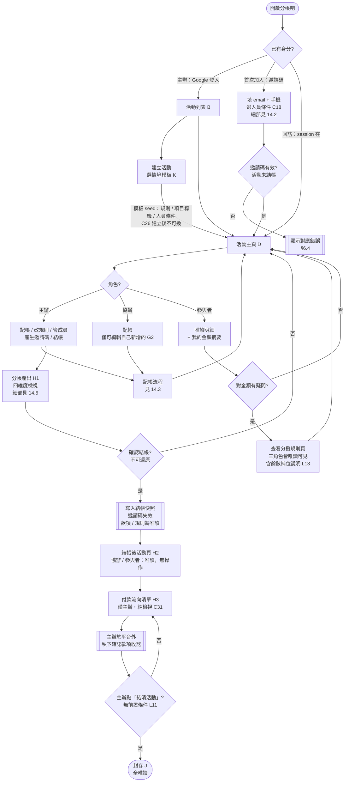
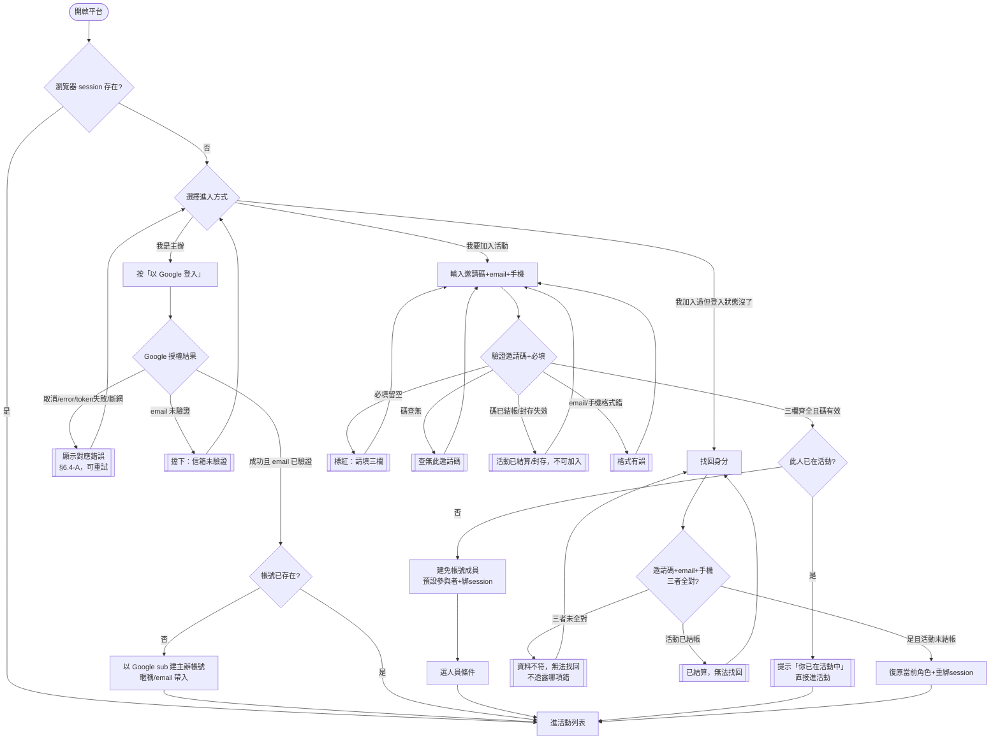
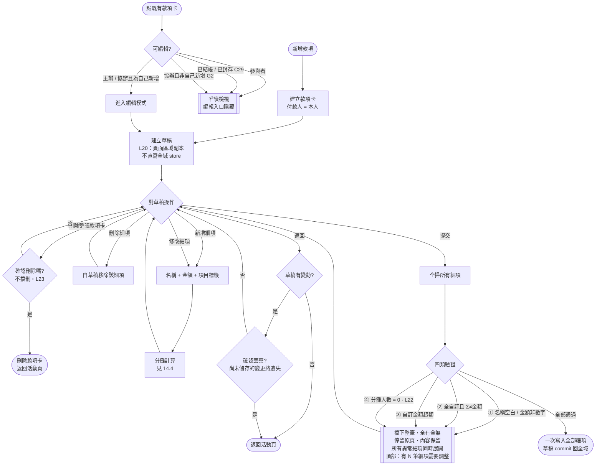
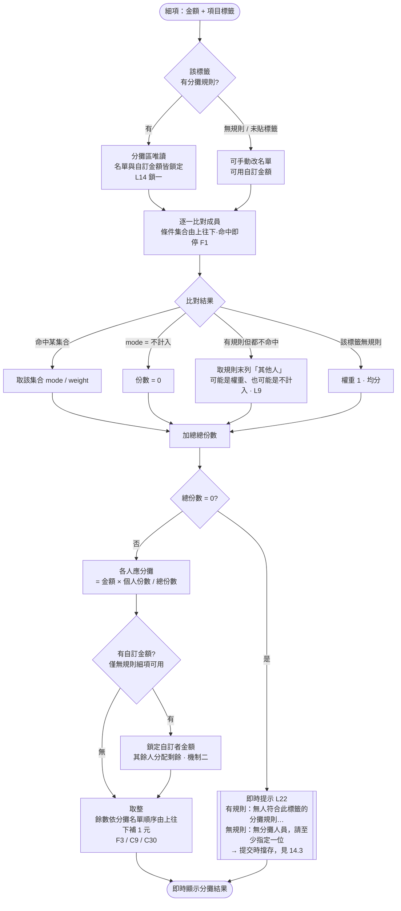
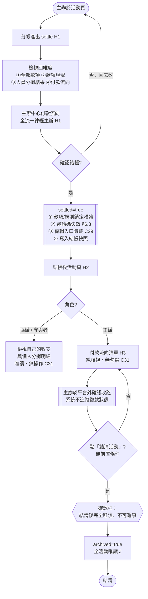
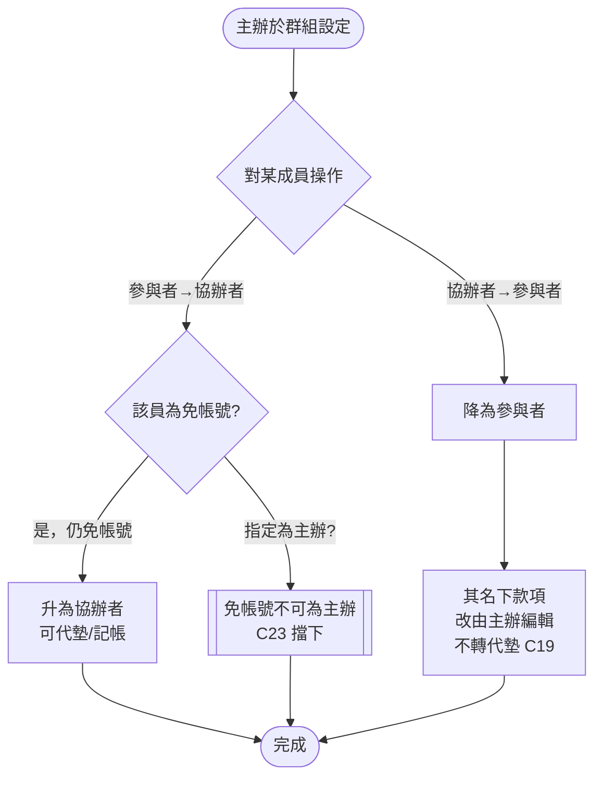

# 群體活動分帳工具 — 產品需求文件（PRD）

> **版本**：v0.16（L10 定案：付款流向改為「主辦中心（hub）」，取代債務極小化）
> **範圍**：MVP / R1
> **撰寫基準**：規則邏輯以團隊確認之規則為準；prototype 現況落差另列專章（§13 已依 v13 實際程式碼重新核對）
> **閱讀對象**：工程、QA、設計、團隊協作成員
> **文件性質**：施工藍圖等級 — 工程可直接開發、QA 可直接寫測試

> **v0.16 重點**：**L10 定案——付款流向採「主辦中心（hub）」，不採債務極小化**。所有應付款項**統一交給主辦人**；若協辦者代墊較多，由**主辦人轉給協辦者**；**參與者與協辦者之間不產生任何金流**。原 §5.2 鎖定的貪婪法（債務極小化）**撤銷**。R1 **僅實作 hub 一種策略**，快照仍記錄 `strategy` 欄位以防日後策略變更造成歷史數字漂移。
>
> **v0.15 重點**：**L25 核心資料模型補正**——§2.4 自 v0.3 後未隨各版定案同步，本版一次補齊：①`rules[]` 補 **`rest`（其他人列）**（L9 定案僅補在 §3.1，§2.4 漏寫，工程照 §2.4 建表將導致烤肉模板交通費規則算錯）②`detail` 補 **`id`**（分攤結果關聯與 H2 追溯所需）③`detail` 補 **`manualMemberIds[]` / `customAmounts[]`**（機制二自訂金額自 v0.3 起即無資料模型支援）④`event` 補 `id` / `name` / `date` / `inviteCode` ⑤命名統一（`by`→`payerId`、`tags[]`→`condTags[]`）⑥明訂 **`members[]` 陣列順序即分攤名單順序**（C9 尾差補位依據）⑦明訂 **`shares[]` 語意**：有出現即參與分攤，缺席即 0 元。
>
> **v0.14 重點**：**C28 收斂**——原五項待決拆為三類：①**載入中／連線失敗**自 C28 拆出，改列為 §3.3 機制四的**提交態規格**（C12／L20 已定案行為、僅缺畫面態，屬工程必做而非產品待決）②**警示類**（僅主辦一人結算、無款項結算）建議「警示但可繼續」③**引導類**（零活動首用、空標籤庫）建議直接做。可作為目前開發中的**錯誤狀態檢查點**。
>
> **v0.13 重點**：**L23 結案**——款項卡刪除**維持現況**，不擋刪、不顯示影響範圍，點擊刪除僅顯示「確認刪除嗎？」確認框。§4.2 G2 補一列規格＋一條 AC 明文化；§13.2 L23 移出待修清單；§14.3 圖上待確認註記移除。
>
> **v0.12 重點**：① **C31 定案——繳款標記機制自 MVP 全面移除**：移除協辦／參與者的「通知繳款」按鈕（含主辦端的 disabled 顯示）、移除 H3 繳款清單的勾選框，H3 改為**純檢視的付款流向清單**；主辦於**平台外**私下確認款項收訖後，直接點「結清活動」。**C14 撤銷**，繳款 flag（`paid`／`paidBy2`）自資料模型移除。② §14 操作流程圖重整為**七張**：14.1 改寫、原 14.3 拆為 14.3（記帳流程：新增與編輯）＋ 14.4（分攤引擎），其餘順延。③ 新增 **L23**（款項卡刪除未顯示影響範圍）。
>
> **v0.11 重點**：① **L14 定案**——標籤**有**分攤規則 → 個人分攤**名單與自訂金額全部鎖定**、一律以規則為準；標籤**無**規則或未貼標籤 → 可手動編輯。② **L21 定案**——補齊「規則鎖定三鎖」：已被款項使用的 itemTag 不可建立規則（現況已實作、PRD 僅寫一半）、綁定 itemTag 已被款項使用的**規則不可刪除**（規則編輯不受限）。三鎖共同保證不變量「**有規則的細項上永遠不存在手動分攤資料**」。③ **L22 定案**——除零（分攤人數 0）由「顯示提示」升級為**擋存級異常**，兩種情境文案、即時提示＋提交擋存雙層。④ **L13 定案**——逐筆推導說明（trace）**列入 R2**；MVP 的可驗證性改由「規則頁三角色唯讀可見 ＋ L14/L21 鎖定」達成，並將**餘數補位規則寫入規則頁說明**。⑤ **C6 結案**（被 L14 吸收）。⑥ 新增附錄 C：R2 規劃項目清單。
>
> **v0.10 重點**：**C12 結案**——新增與編輯**統一採整筆提交（atomic）**，移除「逐筆即時存」選項（前後端分離下減少 API 往返）。連帶 **C11 結案**——多細項分攤異常改為**全部展開＋頂部筆數摘要**（整筆提交下 C11 不會被 C12 吸收，須自行回答）。§3.3 F3 機制三補「全有全無＋停留原頁」規格、§4.2 G2 畫面狀態表補異常態、§13.2 L8 升級為確定要做、新增 **L20**（前端草稿層：prototype 直寫全域 store 的寫法不可直譯移植）。
>
> **v0.9 重點**：① **L9 定案**——恢復規則末列「**其他人**」可編輯規格（v0.8 誤刪、prototype 一直有做、烤肉模板正在使用），§3.1／§3.2 同步修正並補 2 條 AC。② **L11 定案**——封存**無前置條件、不需全員繳清**，§14.1／14.4／14.6 三張圖修正以對齊 §5.4／§11 原定案；§11 J 區補「封存後繳款 flag 凍結」。③ **§13 重新核對**——3 項自 §13.3 移入 §13.1（誤列待補）、新增 L9–L19 共 8 項落差。
>
> **v0.8 重點**：新增 **§14 操作流程圖**——6 張 Mermaid 圖（全局主線／進入識別／記帳→引擎／結算主線／身分變更／活動狀態機），把散在各功能區的規格串成使用者實際路徑，每張圖附對應規格章節與關鍵分支。
>
> **v0.7 重點**：關閉 L1/L2（權重輸入限制）、L6（報表/複製行為）三項落差。
>
> **v0.5–0.6 重點**：收據移 R2、Google 登入、§6.4 錯誤狀態總表、C25–C30 結案。
>
> **v0.4 核對基準檔**：`分帳吧_Prototype_v13_死碼清除__dc.html`（實作）＋`分帳吧_Prototype_內容盤查_dc.html`（盤查）。v0.4 重點：①§13 對照 v13 實際程式碼；②新增 §11.5 情境模板；③新增 C24–C30 待決策項。

---

## 0. 文件導讀

本文件由既有 UI（Claude Design 產物）反推整理而成，非從零撰寫，因此：

- **已鎖定內容**：經逐項確認、可直接開發的規格。
- **待確認項（C 系列）**：尚未拍板、需你或組員決定的項目，集中於 §12。**開發前必須先清這些**。
- **prototype 落差**：目前 prototype 與目標規格的差異（待補 / 疑似 bug），集中於 §13。

閱讀順序建議：先看 §1 產品概述 → §2 角色與資訊架構（理解全局）→ §3 規則引擎（核心）→ 其餘功能區（含 §11.5 K 情境模板）→ **§14 操作流程圖（把規格串成使用者路徑）** → §12/§13（待辦）。**若只想看「prototype 跟 spec 差在哪」，直接跳 §13.2（L1–L8）；想快速理解全貌，直接看 §14 六張流程圖。**

---

## 1. 產品概述與目標

### 1.1 問題

臨時性社交團體活動（烤肉、露營、KTV、聚餐）的費用分攤，現況多靠**試算表 + LINE 群組**手動處理。痛點有二：

1. **算得準**（生產端基線）：主辦人要正確算出「誰該分多少」，遇到條件式分攤（吃素的不分肉錢、不喝酒的不分酒錢）時，手算極易出錯。
2. **追得到**（消費端差異化）：參與者對任何一個數字有疑問時，無法自行驗證這筆錢怎麼來的 —— 只能相信主辦人。

### 1.2 解法與 USP

**條件式分攤引擎** + **可驗證的信任**。

- 引擎是「因」：處理複雜的條件式成本分攤規則。
- 可追溯是「果」：每一筆分攤金額都能逐項回溯到來源細項。

> **差異化關鍵**：算得準是競品可複製的基線；**可驗證**才是把「正確」轉化為「群體信任」的護城河。只有可驗證性能解決「懷疑型」爭議。

### 1.3 三大目標用戶

| персона | 角色 | 核心需求 |
|---------|------|---------|
| 小凱 | 輪值主辦人（primary）| 快速、正確地算完帳並讓大家心服口服 |
| 阿豪 | 協辦者（代墊者）| 記自己墊的錢、事後順利收回 |
| 小美 | 參與者（懷疑者）| 能驗證每個跟自己有關的數字 |

### 1.4 MVP 路線圖與複雜度

> **產品原型前的 MVP 定義**：依「walking skeleton」原則，MVP = 能端到端走通、且觸發條件式分攤引擎的最短手動路徑。系統自動化（自動分類、即時繳款狀態、OCR）延後 R2。此為原型設計前的範圍界定，功能區細節見 §3 以後各區。

| 階段 | In Scope | Out of Scope | 複雜度 |
|------|----------|-------------|--------|
| **MVP / R1** | • 條件式分攤引擎（F1-F3，Approach A 含零權重排除）<br>• 手動記帳（G，收據見 C24）<br>• 結算+主辦中心付款流向（H1）<br>• 付款流向清單（H3，純檢視）<br>• 三角色權限、群組管理（D/E）<br>• 邀請碼加入（A/C）<br>• 情境模板（K：自訂＋烤肉/露營）| • Approach B 指定群組百分比<br>• OCR、自動分類<br>• 真實金流串接<br>• 催收提醒<br>• 4 個未規劃模板內容 | 引擎:高<br>其餘:中 |
| **R2** | • Approach B 分攤<br>• 參與者自助改條件<br>• **收據影像上傳/預覽/刪除**<br>• OCR 收據辨識<br>• 其他第三方登入（Apple/Facebook）<br>• 結算報表下載/複製 | • 跨活動聯合結算<br>• 預測性分析 | 中~高 |

> **技術複雜度說明**：引擎（F）標「高」係因餘數演算法 + 有序條件比對 + 唯一性約束的組合；其餘功能多為 CRUD + 狀態機，標「中」。

### 1.5 成功指標（NSM）

> **產品原型前的成功指標定義**：兩階段 NSM，界定「做出來要看什麼數字」。

| 階段 | NSM | 為何 |
|------|-----|------|
| 驗證期 | **結算週期中位數**（從活動開始到結清的天數）| 中位數優於平均（右偏分布、早期小樣本）|
| 成長期 | **結清歸零活動數**（完整走完並全額結清的活動數）| 兌現產品完整價值的活動量 |

### 1.6 主要競品

**真正的競品是「試算表 + LINE 群組」**，非 Splitwise / LINE Pay。最具時效性的威脅是 Lightsplit 若加入條件式分攤邏輯。

---

## 2. 角色與資訊架構

### 2.1 角色與權限（3 種 + 帳號模型）

| 角色 | 代碼 | 需帳號 | 可做 | 不可做 |
|------|------|:---:|------|--------|
| 主辦人 | `host` | ✅ **需帳號** | 新增/編輯所有款項、設定分攤規則與標籤、管理成員、指定協辦者、結帳、結清 | — |
| 協辦者 | `co` | ❌ 免帳號 | 新增款項、**僅編輯/刪除自己新增的**明細 | 改規則、改別人明細、群組管理、結帳 |
| 參與者 | `member` | ❌ 免帳號 | 檢視明細、查看自己的金額 | 新增/編輯任何款項、改規則、群組管理 |

> **帳號模型（v0.3 大改）**：
> - **僅主辦人需註冊帳號**；協辦者、參與者**免帳號**，靠瀏覽器 **session** 識別。
> - **協辦者的產生**：先以參與者身分免帳號加入，再由主辦人於群組管理**指定為協辦者**（協辦者仍免帳號、仍靠 session）。
> - 免帳號成員以 **email + 手機**作為找回記號（純記號、系統不驗證真偽）。
> - 免帳號加入與 session 找回機制見 §6（A 區）。訪客技術規格（原 C21）大部分由此定案。

### 2.2 分帳四維度（全域資訊架構）

不同頁面呈現不同維度，逐層加深，對應計算鏈 F2 → F3 → H1：

| 維度 | 內容 | 呈現位置 | 可見對象 |
|------|------|---------|---------|
| **①全部款項** | 每筆款項金額 + 全體合計 | 活動頁（明細列表）／分帳產出頁（金額+合計）| 活動頁三角色可見；分帳產出頁僅主辦 |
| **②款項現況** | 款項明細（細項、標籤、分攤名單）| 款項細項頁 | 依權限（協辦限own編輯、參與唯讀）|
| **③人員分攤結果** | 每人的分攤金額 + 代墊金額 | 分帳產出頁 | 僅主辦（封存後可見）|
| **④人員付款流向** | 每人要付/收給誰、多少 | 分帳產出頁、H3 付款流向清單 | 僅主辦（封存後可見）|

### 2.3 金額名詞定義（全域術語，鎖定）

| 名詞 | 視角 | 定義 | 工程對照 |
|------|------|------|---------|
| **合計** | ⚠️**全體** | 全部總支出金額 | Σ 所有款項 |
| **應分攤** | 自己 | 我在所有款項細項被分攤的總額 | totals[me] |
| **已代墊** | 自己 | 我墊付的款項總額 | paidBy[me] |
| **總結應得** | 自己 | 已代墊 − 應分攤 **≥ 0**（別人還我）| net ≥ 0 |
| **總結應付** | 自己 | 應分攤 − 已代墊 > 0（我付別人）| net < 0 |

> **注意混合視角**：活動頁頂部摘要 `合計 ｜ 應分攤 ｜ 已代墊` 中，**合計是全體視角**，後兩者是自己 —— 設計意圖為「大盤 vs 我的位置」一眼對照。「合計」是全域唯一的全體視角術語，需明確標示避免混淆。

### 2.4 核心資料模型

```
event（活動）
 ├─ id, name, date           // 活動基本資訊（§7 B 區列表需顯示活動名、日期）
 ├─ settled: bool            // 是否已結帳
 ├─ archived: bool           // 是否封存（結清後）
 ├─ inviteCode               // 綁本活動；settled 後失效（§6.3、L17）
 ├─ members[]                // 成員　⚠️ 陣列順序即「分攤名單順序」，見下註①
 │    └─ { id, name, role, condTags[](人員條件), virtual,
 │           email, phone,        // 免帳號找回記號（不驗證；settled 前有效）
 │           sessionRef }         // 瀏覽器 session 識別
 ├─ itemTags[]: string[]     // 項目標籤（單一種類，A方案）；以「名稱」為識別，見下註②
 ├─ condTags[]: string[]     // 人員條件清單；以「名稱」為識別
 ├─ rules[]                  // 條件式分攤規則
 │    └─ { itemTag(跨規則唯一),
 │         condSets[{ condTags[], mode, weight }],  // 有序，由上往下、命中即停
 │         rest: { mode, weight } }                 // ⭐「其他人」列（L9）
 └─ items[]                  // 款項卡片
      └─ { id, payerId, receipt(bool；R1僅布林旗標，影像上傳R2), details[] }
           └─ detail { id, name, amount, itemTag(0 或 1 個), note,
                       manualMemberIds[],                     // 見下註③
                       customAmounts[{ memberId, amount }],   // 見下註③
                       shares[{ memberId, amount }] }         // 見下註④

settlement（結帳快照）        // settled 時一次性寫入、不可變
                             // 結構另訂；H2／H3／封存頁一律讀快照，不重算
```

**資料模型註記（L25，v0.15）**

**註①　`members[]` 陣列順序 = 分攤名單順序**
C9／C30 定案「餘數依分攤名單順序由上往下補 1 元」，此順序即由本陣列決定。**後端不得重排**（換 ORM、加預設排序、依姓名排序皆會悄悄改變尾差落點）。結帳快照須連同順序凍結。

**註②　標籤以「名稱」為識別，非 id**
`itemTags[]`／`condTags[]` 為字串陣列；`rules[].itemTag`、`rules[].condSets[].condTags[]`、`members[].condTags[]`、`detail.itemTag` 皆存**名稱**。語意上「標籤改名 = 換一個標籤」。

**註③　`manualMemberIds[]` 與 `customAmounts[]` 僅於「無規則細項」有值**
依 L14 定案，細項所貼的 itemTag **有**分攤規則時，分攤名單與自訂金額皆不可編輯，此二欄位一律為 `null`；**無**規則或未貼標籤時才可有值。
- `manualMemberIds[]`：主辦手動指定的分攤名單（機制〇）
- `customAmounts[]`：主辦為特定成員指定的金額（機制二）

**不另設 `splitMode` 欄位**——「可否手動編輯」由「該 itemTag 有無規則」即時推導（`canEditShares = !hasRule(itemTag)`），無需額外狀態。

**註④　`shares[]` 語意：有出現即參與分攤，缺席即 0 元**

| 狀態 | 意義 |
|------|------|
| 成員**不在** `shares` | **未參與分攤**（被規則排除、落「其他人」且設不計入、或未在手動名單中）→ 金額 0 |
| 成員**在** `shares` 且 `amount = 0` | **參與分攤但金額為 0**（自訂金額 0，或權重極小取整後為 0）|

兩者在資料上可區分，故**不另存 `excluded[]`**；被排除名單可由「全體成員 − shares 名單」推導。

> ⚠️ **H2 個人分攤明細的實作要求**：須**逐一走訪該活動的所有細項**、查該成員於各細項的 share（查無即 0），**不可只走訪 `shares`**。否則未參與的細項會在個人明細中**整列消失**，而非顯示 0 元——使用者將無法分辨「我沒份」與「系統漏算」。

---

## 3. 功能區 F：條件式分攤引擎 ⭐（核心 USP）

> 本區是產品心臟。分三塊：F1 資料模型、F2 計算演算法、F3 餘數與儲存防呆。

### 3.1 F1 — 標籤與規則資料模型

分攤引擎有三種基礎資料，規則把它們串起來。

#### F1-a 人員條件（condTag）— 「誰是什麼樣的人」

| 項目 | 規格 |
|------|------|
| 是什麼 | 貼在「人」身上的標籤（吃素、不喝酒、不吃牛、食物過敏）|
| 資料位置 | `member.tags[]` ＋ 活動層 `condTags[]` |
| 誰能首次填 | **參與者本人**，於加入時（joinForm）勾選飲食習慣 |
| 誰能事後編輯 | **僅主辦人**，於「群組設定－群組人員」頁 |
| 刪除防呆 | 被任何人員使用中 → 擋刪「已被使用在人員上，不可刪除」|

#### F1-b 項目標籤（itemTag）— 「這筆錢是什麼性質」

> 採 **A 方案（C8 定案）**：項目標籤單一種類；**一筆細項只能貼一個 itemTag**。理由：學習成本低，複雜度應集中在條件規則本身，而非標籤的排列組合。耦合問題（單細項多標籤）從資料結構層根除。

| 項目 | 規格 |
|------|------|
| 是什麼 | 貼在款項細項上，標示這筆錢的性質（肉/酒/交通/其他）|
| 一細項可貼幾個 | **恰好 1 個**（單一 itemTag）|
| 誰能管理 | 僅主辦人，於「分攤規則」頁 |
| 與 rule | 每個 itemTag **最多被一條 rule 引用**（跨規則唯一）|
| 刪除防呆 | 被任何款項細項使用中 → 擋刪「已被使用在款項上，不可刪除」；**條件式分攤規則的引用不列入判斷** |

> **無「純記帳標記」需求**：C8 定案不採一般標籤，若日後出現純分類需求再議（R2）。

#### F1-c 條件式分攤規則（rule）— 「什麼標籤的錢、什麼條件的人怎麼分」

```
rule = {
  itemTag: '肉',                       // 恰好一個分攤標籤，跨規則唯一
  condSets: [                          // 有序陣列，由上往下比對，命中即停
    { condTags: ['吃素'],              mode: 'exclude' },
    { condTags: ['食物過敏','不吃牛'], mode: 'weight', weight: 2.5 }
  ],
  // 任何條件集合都不符合的人 → 落到規則末列「其他人」
  rest: { mode: 'weight', weight: 1 }  // 「其他人」列，可編輯：
                                       // 可選 mode:'exclude'（不計入）或自訂 weight
                                       // 預設帶 1、未動即維持 1
}
```

| 項目 | 規格 |
|------|------|
| 誰能設定 | 僅主辦人（協辦/參與者唯讀檢視）|
| 一規則的項目標籤 | 恰好一個。新增規則時，標籤下拉**同時排除兩類**：<br>① 已被**其他規則**使用（跨規則唯一）<br>② ⭐ **已被任何款項細項使用**（L21-a）<br>例外：編輯既有規則時，保留該規則自己的標籤 |
| 規則刪除防呆（L21-b）⭐ | 綁定的 itemTag **已被任何款項細項使用** → **擋刪**<br>文案：「『肉品』已被 N 筆款項細項使用，不可刪除規則」<br>解法指引：需先移除該些細項的標籤；提示應提供**「查看這 N 筆」**入口（可簡化為篩選款項列表）<br>⚠️ **判斷依據為 `ruleTagUsed(rule.itemTag)`（掃款項細項），與 itemTag 本身的刪除防呆（F1-b）為不同判斷，不可共用 `tagUsedWhere`** |
| 規則編輯 | 條件集合、權重、「其他人」列**不受上述鎖限制，未結帳前隨時可改**；改後已記錄細項自動重算 |

> **⭐ 規則鎖定三鎖與核心不變量（L14／L21 定案，v0.11）**
>
> **不變量：有分攤規則的細項上，永遠不存在手動分攤資料。**
>
> | 鎖 | 內容 | 出處 |
> |---|------|------|
> | 鎖一 | 標籤**有規則** → 該細項的個人分攤**不可手動編輯**（名單與自訂金額皆不可）| L14，§3.3 |
> | 鎖二 | **已被款項使用**的 itemTag → 不可建立新規則 | L21-a，本節 |
> | 鎖三 | 綁定 itemTag **已被款項使用** → 規則**不可刪除**（編輯不受限）| L21-b，本節 |
>
> 三鎖缺一不可：少了鎖二 → 可「先手動調、再建規則」，手動資料被覆蓋；少了鎖三 → 可「刪規則解鎖手動編輯」，且**刪掉後因鎖二建不回來**。
>
> **「編輯開放、刪除擋下」的不對稱是刻意的**：編輯可逆（改回去即可），刪除不可逆（鎖二使其無法重建）。
>
> **推論**：三鎖成立後，「規則變更覆蓋手動資料」的情境**結構性不存在**——標籤不可能從「無規則」變成「有規則」，故規則重算永遠不會覆蓋任何手動值。`splitMode` 欄位、「還原自動」按鈕、重算覆蓋提示**皆不需要**。

**餘數補位說明（L13 定案連帶，v0.11）**

| 項目 | 規格 |
|------|------|
| 規則頁固定說明區 | 規則頁須提供**不隨規則數量變動**的固定說明區塊，向三角色（皆可唯讀檢視規則頁）說明餘數補位規則 |
| 說明文字 | 「**關於分攤餘數**：分攤金額以「元」為單位，無法整除時，餘數會依該筆細項的分攤名單順序，由上往下每人補足 1 元，直到分完為止。例：1,200 元由 5 人均分，每人 240 元剛好整除；1,202 元由 5 人均分，前 2 位各多分 1 元。」|
| 設計意圖 | 尾差補位（C9／C30）是**演算法**、不在任何一條規則內，使用者無法從規則內容推導。MVP 不做逐筆推導說明（L13→R2），故以此固定說明承擔解釋責任 |
| 一規則的條件集合 | 可多個，有序，由上往下比對 |
| 單一條件集合內多條件 | **AND**（此人需同時具備）|
| 命中規則 | 由上往下找第一個符合的條件集合，套用後即停 |
| 都不符合（其他人）| 落到規則末列「**其他人**」：權重**可編輯**，可選「不計入」或自行輸入權重，**預設帶 1**、未動即維持 1（工程對照欄位 `rest`）|
| 「其他人」權重校驗 | 與條件集合權重**同一套規則**：`0.1 ≤ 值 ≤ 100`、小數 1 位、輸入 `0` 自動轉「不計入」。L1／L2 定案**一併適用於「其他人」列**（prototype 對應 `setRestPct`，與 `setPct` 為兩支獨立函式，需同步修）|
| 權重範圍 | **0.1 ~ 100.0**，小數點後最多一位，**預設帶 1**；**校驗 `0.1 ≤ 值 ≤ 100`**（L1/L2 定案）|
| 輸入 0 的處理 | 使用者於權重欄輸入 `0` → **自動轉為「不計入」選項**，不接受 0 作為權重值（呼應 C25：以「不計入」取代權重 0）|
| 不計入 | 介面提供獨立選項「**不計入**」（取代「權重 0」的說法，降低理解成本）；底層以 `mode:'exclude'` 表示，實作上等同權重 0（C25 定案：底層可合併、介面維持分開）|
| condTags 關係 | rule **引用** F1-a 的條件名，不擁有它 |

**F1 驗收標準**

> 以下前三條為 v0.11 新增（L21 規則鎖定三鎖 ＋ 餘數說明）。

| 規則 | Given / When / Then | Edge Case |
|------|---------------------|-----------|
| 項目標籤唯一性 | **Given** 已存在「肉規則」<br>**When** 主辦人新增規則、開項目標籤下拉<br>**Then** ①「肉」不出現在可選清單 ② 只能選未被用掉的標籤 | • 刪除肉規則後「肉」重新可選<br>• 改名肉標籤 → 規則綁定跟著改名（不斷連結）|
| 條件集合由上往下 | **Given** 肉規則 condSets=[①吃素→不計入, ②不吃牛→權重2]，某人同時有吃素、不吃牛<br>**When** 計算肉款項<br>**Then** ① 命中① → 不計入 ② **不再看②** | • 只有不吃牛 → 跳過①命中②<br>• 兩者都沒 → 落到「其他人」列（預設權重 1，主辦可改權重或設為不計入）|
| 已用標籤不可建規則（L21-a）| **Given** 已有 5 筆細項貼「交通費」、且尚無交通費規則<br>**When** 主辦新增規則、開啟項目標籤下拉<br>**Then** ①「交通費」呈 **disabled**（非直接消失）② 顯示原因「已被 5 筆款項使用，無法建立規則」| • 移除全部 5 筆的標籤 → 重新可選<br>• 若原因為「已被其他規則使用」→ **文案須不同**（「已被『肉品』規則使用」），因解法不同<br>• 編輯既有規則時，該規則自己的標籤**不受此限** |
| 已用規則不可刪除（L21-b）| **Given** 肉品規則存在、12 筆細項貼「肉品」<br>**When** 主辦點刪除肉品規則<br>**Then** ① 擋下 ②「『肉品』已被 12 筆款項細項使用，不可刪除規則」③ 規則保留 ④ 提供「查看這 12 筆」入口 | • 無款項使用 → 可刪<br>• 移除全部標籤後 → 可刪<br>• **刪除鈕維持可見**（點擊後才提示，非隱藏入口）<br>• 判斷須用 `ruleTagUsed`，**不可共用 `tagUsedWhere`**（後者含規則引用，會導致規則永遠刪不掉）|
| 已用規則仍可編輯 | **Given** 同上<br>**When** 主辦把肉品規則的「小孩」權重 0.5 改為 0.6<br>**Then** ① 允許儲存 ② 12 筆細項分攤**自動重算** ③ **無任何手動資料被覆蓋**（三鎖不變量保證）| • 新增／刪除條件集合 → 同樣開放<br>• 修改「其他人」列 → 同樣開放<br>• 已結帳則規則鎖定唯讀（既有規格）|
| 餘數補位說明可見 | **Given** 任一活動的規則頁<br>**When** 三角色任一開啟規則頁<br>**Then** ① 顯示固定說明區塊 ② 含「餘數依分攤名單順序由上往下補 1 元」與具體例子 | • 規則數為 0 → 說明區**仍顯示**<br>• 已結帳 → 說明區仍顯示 |
| 其他人權重可編輯 | **Given** 主辦人把規則末列「其他人」改為權重 2<br>**When** 某人不符合任何條件集合<br>**Then** ① 套用「其他人」權重 2（**非固定 1**）② 該人計入總份數 | • 未動 → 維持預設 1<br>• 設為「不計入」→ 其他人完全排除、不計入總份數<br>• 於「其他人」欄輸入 0 → 自動轉「不計入」（L1）|
| 其他人設不計入 → 白名單制 | **Given** 交通費規則 condSets=[①自行前往→不計入, ②需搭主辦的車→權重1]、**其他人＝不計入**<br>**When** 某成員兩個條件都沒貼<br>**Then** ① 走「其他人」→ 不計入 ② 該細項分攤 0 元 | • **全員皆未命中且其他人＝不計入 → 總份數 0 → 走除零保護 C7「無人分攤」**<br>• 此為 §11.5 K 區烤肉模板「交通費」規則的實際行為，**須納入回歸測試** |
| 條件集合 AND（至少包含）| **Given** 集合=[食物過敏 AND 不吃牛]<br>**When** 某人具備此兩條件（可另有其他條件）<br>**Then** ① 符合此集合（額外條件不影響）| • 只有食物過敏 → 不符合，往下找<br>• 具備兩者+吃素 → 仍符合（至少包含）|
| 權重防呆 | **Given** 主辦人編輯權重欄<br>**When** 輸入 `-1`、`101`、`2.55`、`abc`（非法值）<br>**Then** ① 擋下 ② 欄位維持編輯 ③ 提示範圍 0.1~100、小數1位 | • 空白 → 帶預設1<br>• `0.5`、`2.5` → 合法<br>• 第 2 位小數不接受（`2.55`→`2.5`）|
| 權重輸入 0 | **Given** 主辦人編輯權重欄<br>**When** 輸入 `0`<br>**Then** ① **不作為權重值** ② 自動轉為「不計入」選項（L1 定案）| • 已選「不計入」再輸入權重→ 切回權重模式<br>• 非「歸零擋下」，而是「轉不計入」|

**F1 複雜度**：中（資料結構 + 唯一性約束 + 有序比對）

**Out of Scope（F1）：**
① 項目標籤不可被多條規則共用 ② 加入後參與者不可自改條件 ③ 不做規則 OR 邏輯 ④ 不做跨項目規則疊加 ⑤ 不做一人多規則疊加

---

### 3.2 F2 — 分攤計算演算法

把一筆細項金額，依「權重 × 人數」拆成每人應分攤。

**演算法四步**

1. **每人定權重**：對每個成員跑 F1 規則比對，得權重 —— exclude 者不參與；命中條件集合者取該集合的 weight；未命中任何條件集合者取規則末列「**其他人**」的設定（預設權重 1，主辦可改為其他權重或「不計入」）。
2. **算總份數**：Σ（每個計入者的權重）。
3. **每份單價**：細項金額 ÷ 總份數。
4. **每人金額**：每份單價 × 個人權重，再套 F3 餘數處理取整。

**黃金範例（1300 元）**

| 條件 | 人數 | 個人權重 | 該群總份數 |
|------|------|---------|-----------|
| A 標籤者 | 2 | 2 | 4 |
| B 標籤者 | 3 | 3 | 9 |
| **合計** | 5 | — | **13** |

每份 = 1300÷13 = **100**；A 每人 **200**、B 每人 **300**；驗算 200×2+300×3=1300 ✓

| 項目 | 規格 |
|------|------|
| 計算單位 | **每筆細項獨立計算**（不同細項標籤不同）|
| exclude 者 | 不列入總份數，該細項分攤 0 元 |
| 除零保護 | 全員 exclude／分攤名單為空 → 總份數 0 → **不崩潰** |
| 除零擋存（L22）⭐ | 分攤人數 = 0 → **視為細項異常，擋下整筆提交**（與 mismatch／overflow 同級，接入 §3.3 機制四的全掃驗證）|
| 除零文案・情境 A | **標籤有分攤規則**（使用者依 L14 不可改分攤，只能改標籤／規則／成員條件）：<br>「**無人符合此標籤的分攤規則，請改用其他標籤，或調整規則／成員條件標籤**」|
| 除零文案・情境 B | **標籤無規則或未貼標籤**（使用者可改分攤名單）：<br>「**無分攤人員，請至少指定一位分攤者**」|
| 除零即時提示 | 貼上標籤／修改分攤名單**當下**，若分攤人數變為 0 → 分攤區即時顯示上述文案，不需等到提交。即時提示與提交擋存**兩層皆須有** |
| 恆等式保護（設計意圖）| 此擋存的根本目的：避免「該筆代墊金額 ≠ 分攤總和」的細項存入，導致 **Σ淨額 ≠ 0**、付款流向演算法無法配對、該筆款項**永遠無法結清**且系統不提示 |

**F2 驗收標準**

| 規則 | Given / When / Then | Edge Case |
|------|---------------------|-----------|
| 權重加總分攤 | **Given** 細項1300，A標籤2人(權重2)、B標籤3人(權重3)<br>**When** 計算<br>**Then** ① 總份數13 ② 每份100 ③ A每人200、B每人300 ④ 驗算=1300 | • 有人exclude→不計入<br>• 有人預設權重1→算1份 |
| 混合預設權重 | **Given** 1000元，甲權重2、乙丙未命中任何條件集合、落「其他人」列(權重1)<br>**When** 計算<br>**Then** ① 總份數4 ② 每份250 ③ 甲500、乙丙各250 | • 全落「其他人」列且權重1 → 退化為均分<br>• 主辦把「其他人」列改權重 → 比例隨之變<br>• 「其他人」列設不計入 → 乙丙皆 0 元 |
| 除零保護 | **Given** 某細項全員被exclude<br>**When** 計算<br>**Then** ① 總份數0 ② 不崩潰 | • 指定ids為空→同上 |
| 除零擋存・情境A（L22）| **Given** 細項 1,200 貼「交通費」、規則「其他人＝不計入」、全員皆未貼交通條件<br>**When** 提交<br>**Then** ① **擋下整筆**（全有全無）② 停留原頁 ③ 該細項分攤區展開＋紅框 ④「無人符合此標籤的分攤規則，請改用其他標籤，或調整規則／成員條件標籤」⑤ 計入頂部筆數摘要 | • 改貼無規則標籤 → 退化均分、可存<br>• 幫任一成員貼「需搭主辦的車」→ 可存<br>• 將規則「其他人」改為權重 1 → 可存<br>• **此為烤肉模板的真實路徑，須納入回歸測試** |
| 除零擋存・情境B（L22）| **Given** 細項貼無規則標籤、主辦手動取消勾選全部成員<br>**When** 提交<br>**Then** ① 擋下 ②「無分攤人員，請至少指定一位分攤者」| • 勾回任一人 → 可存<br>• 此情境**可由使用者自行修正**（L14 未鎖定無規則細項）|

> **權重解析的四種結局（工程實作務必窮舉）**：① 命中某條件集合 → 取該集合 mode/weight；② 有規則但未命中任何條件集合 → 取「**其他人**」列設定（可能是不計入）；③ 該 itemTag **無對應規則** → 權重 1（均分）；④ 該細項**未貼 itemTag** → 權重 1（均分）。**②與③是不同的分支，不可合併** —— ②可能不計入、③一定計入。

**F2 複雜度**：中（演算法 + 除零邊界）

**Out of Scope（F2）：**
① 不做 Approach B（指定群組百分比，R2）② 不做整筆款項統一分攤 ③ 權重僅作用人頭份數，不涉金額比例 ④ **MVP 僅「均分＋權重」兩種分攤方式（C27 定案）**，均分為權重的退化（全員權重相同）；不新增其他方式

---

### 3.3 F3 — 餘數處理與儲存防呆

F2 算出的每人金額多半除不盡。F3 負責取整、處理自訂金額、金額對不上時擋存。核心精神：**分毫不差、且看得出錢去哪**。

#### 機制一：餘數輪流分配

| 項目 | 規格 |
|------|------|
| 計算基準 | 整數計算，每人先取整 |
| 餘數 | 細項金額 − Σ(各人取整) = 餘數（正整數，單位 1 元）|
| 分配對象 | 只分給「鎖定（依規則分攤）」者（未自訂金額者）|
| 分配方式 | 餘數每 1 元，依**該細項分攤名單順序**由上往下輪流補，直到餘 0 |

**黃金範例**：細項 101 元、3 名鎖定者權重相同 → 各取整33、Σ99、餘2 → 前2人各+1 → **34+34+33=101** ✓

#### 機制〇：個人分攤的可編輯性（L14 定案，v0.11）⭐

> **單一判準**：細項所貼的項目標籤**有沒有分攤規則**。

| 細項狀態 | 分攤怎麼算 | 分攤名單可改嗎 | 自訂金額可用嗎 |
|---------|-----------|:---:|:---:|
| 貼了**有規則**的標籤 | 一律依規則權重 | ❌ | ❌ |
| 貼了**無規則**的標籤 | 均分（權重 1）| ✅ | ✅ |
| **未貼**標籤 | 均分（權重 1）| ✅ | ✅ |

| 項目 | 規格 |
|------|------|
| 判斷方式 | `canEditShares(detail) = !hasRule(detail.itemTag)`——**即時推導，不存欄位** |
| 鎖定範圍 | 有規則時，**分攤名單與自訂金額（機制二）皆不可編輯**，一律以規則為準 |
| UI 呈現 | 分攤區呈唯讀，並說明「本細項套用『肉品』分攤規則，分攤由規則決定」，提供**前往規則頁**入口 |
| 使用者的替代路徑 | 若確有個別金額需求（例：某人多吃），**另開一筆細項**處理，不透過自訂金額 |
| MVP 縮減說明 | 「有規則亦可手動編輯個人分攤」列入 **R2**（見附錄 C）|
| 除零例外 | 有規則且分攤人數 = 0 時**不解鎖手動編輯**，改以 L22 擋存＋引導調整標籤／規則／成員條件（見 §3.2）|

> **與 C6 的關係**：C6（自動↔手動隱性模式切換）**因本定案結案**。模式不再是 detail 上的隱性狀態，而是標籤的推導結果：可預測、可解釋、無切換無感問題。原 prototype「手動接管即把全體權重設為 1、靜默退化為均分」的行為亦隨之消失（路徑被封死）。
>
> **與 L21 的關係**：本鎖為「規則鎖定三鎖」之鎖一。三鎖共同保證「**有規則的細項上永遠不存在手動分攤資料**」，詳見 §3.1 F1-c。
>
> **對機制二／機制三的影響**：自訂金額（機制二）與其擋存防呆（機制三）在 MVP **僅適用於無規則／未貼標籤的細項**。

#### 機制二：自訂金額

| 項目 | 規格 |
|------|------|
| 自訂效果 | 該欄**解鎖為可輸入**，脫離規則、不參與餘數分配 |
| 剩餘者 | 未自訂者仍「鎖定」，共同承接（細項金額 − Σ自訂）|
| 語意 | 自訂 = 此人明確指定金額，故系統**只重算未自訂者** |

#### 機制三：儲存防呆

| 項目 | 規格 |
|------|------|
| 全自訂且 Σ≠細項金額 | 分攤打勾儲存**被擋下**、紅色外框、差額提示、欄位維持編輯 |
| 差額文案 | 「金額合計與品項金額差 NT$ X，請調整後再儲存」（正負差額統一用「差」、取絕對值）|

#### 機制四：整筆提交與全有全無（C12 定案，v0.10）⭐

> **儲存層級（C12 已結案）**：**新增與編輯統一採「整筆提交（atomic）」**——一個款項卡的全部細項一次送出，不做逐筆即時存。決策理由：前後端分離下，逐筆即時存會造成大量 API 往返。

| 項目 | 規格 |
|------|------|
| 提交範圍 | 一張款項卡的**全部細項**（含名稱、金額、標籤、備註、分攤結果）一次提交 |
| ⭐ 提交態（C28 拆出，v0.14）| **提交中**：提交鈕 disable ＋ 載入指示，防重複送出；草稿保留不可編輯或維持可編輯但不再送出（擇一，由前端定）。<br>**後端驗證失敗（4xx）**：比照本表「擋下後行為」——不 commit、停留原頁、草稿完整保留，並顯示後端回傳的錯誤（與前端全掃的四類異常呈現方式一致）。<br>**逾時／連線失敗**：**不得 commit、不得丟棄草稿**，顯示可重試的錯誤提示；重試即重送同一份草稿。<br>**成功**：commit 草稿回全域 store，依原流程跳轉。<br>⚠️ **禁止**：任何情況下前端都不得在未收到成功回應前更新全域 store（L20）——否則會出現「前端顯示一套、後端存另一套」|
| 驗證時機 | **提交當下全掃所有細項**，非逐筆即時驗證 |
| 驗證項目 | ① 每筆細項名稱非空、金額為純數字 ② 分攤全自訂且 Σ≠細項金額 → 異常 ③ 自訂金額加總超出細項金額 → 異常 ④ ⭐ **分攤人數 = 0 → 異常**（L22，文案依 §3.2 分情境 A／B）|
| 全有全無 | **任一筆未過 → 整筆不儲存**，已通過的細項也不寫入（前端不 commit、後端單一 transaction）|
| 擋下後行為 | ⭐ **停留在原頁面**，不跳轉、不清空；使用者輸入的內容完整保留 |
| 異常呈現 | ① **所有**異常細項的分攤區**同時展開**、紅框 ② 逐筆顯示差額文案（C10）③ 頁面頂部顯示**筆數摘要**（見下）|
| 頂部摘要（C11 定案）| 文案：「**有 N 筆細項需要調整**」（v0.11 由「分攤金額需要調整」放寬——除零非金額問題）；可點擊 → 捲動至第一筆異常細項；全部修正後自動收起，不需重按提交 |
| 錯誤持續性 | 異常標記**持續顯示直到修正**，不自動消失（**非** prototype 現行的 1.8 秒閃現）|
| 離開頁面 | 草稿與原始資料不一致（dirty）時，返回須跳確認：「尚未儲存的變更將遺失」|

> **C10 文案並存說明**：C10 鎖定的是**逐筆**文案「金額合計與品項金額差 NT$ X，請調整後再儲存」；頂部摘要是**筆數彙總**，兩者並存、非取代關係。

> **前端實作要求（L20）**：編輯頁的表單狀態必須是**頁面區域的副本（草稿）**，不可直接寫入全域款項 store；提交成功後才更新全域 store。否則 ①「取消」無法真正還原 ②API 回 400／逾時／斷線時，**前端顯示一套、後端存另一套** ③使用者重新整理後數字跳回，反噬「可驗證」的產品信任。詳見 §13.2 L20。

**F3 驗收標準**

| 規則 | Given / When / Then | Edge Case |
|------|---------------------|-----------|
| 餘數往前補 | **Given** 101元、3名鎖定者權重同<br>**When** 分攤<br>**Then** ① 各取整33、Σ99 ② 餘2 ③ 前2人各+1 ④ 34/34/33 | • 餘數=人數→每人+1<br>• 整除→不補 |
| 部分自訂 | **Given** 300元3人，甲自訂150<br>**When** 儲存<br>**Then** ① 甲=150解鎖 ② 乙丙分剩150→各75 | • 剩餘除不盡→依序補<br>• 自訂>總額→擋存 |
| 全自訂擋存 | **Given** 300元三人全自訂100/100/50(Σ250)<br>**When** 打勾儲存<br>**Then** ① 擋下 ② 紅框 ③「金額合計與品項金額差 NT$ 50，請調整後再儲存」④ 欄位保持可編輯 | • Σ=300→正常存<br>• Σ>300→同樣擋 |
| 整筆提交・全有全無（C12）| **Given** 一張款項卡有 3 筆細項，第 1、3 筆正常、第 2 筆分攤 Σ≠金額<br>**When** 按提交<br>**Then** ① 整筆**皆不儲存**（第 1、3 筆也不寫入）② **停留原頁**、輸入內容完整保留 ③ 第 2 筆分攤區展開＋紅框＋差額文案 | • 3 筆中有 2 筆異常 → 兩筆**同時展開**（C11）<br>• 提交成功 → 一次寫入全部細項<br>• 後端 transaction 失敗 → 前端亦不得更新全域 store（L20）|
| 頂部筆數摘要（C11）| **Given** 同上、2 筆細項異常<br>**When** 按提交被擋<br>**Then** ① 頁面頂部顯示「**有 2 筆細項的分攤金額需要調整**」② 點擊摘要 → 捲至第一筆異常 ③ 修正完畢 → 摘要自動收起 | • 僅 1 筆異常 → 「有 1 筆…」<br>• 異常標記**不自動消失**，須修正後才解除 |

**F3 複雜度**：中（餘數演算法 + 儲存狀態機）

**Out of Scope（F3）：**
① 不做跨細項餘數輪替記憶 ② 不支援百分比自訂 ③ 不做差額一鍵自動平攤（P2候選）④ 餘數單位固定 1 元

> **P2 技術備註（多幣別）**：R1 僅台幣。若未來支援多幣別，餘數/取整演算法需參數化最小單位 `minUnit`，R1 固定 `minUnit=1`。


## 4. 功能區 G：記帳（新增款項 → 款項細項）

記帳是「錢進系統」的入口，也是 F 引擎的資料來源。

### 4.1 G1 — 新增款項（addItem）

| 項目 | 規格 |
|------|------|
| 誰能新增 | 主辦人、協辦者；參與者不可 |
| 付款人 | 預設當前操作者本人 |
| 一張款項 | 含 **0~N 筆細項**（可先建卡、之後補細項）|
| 細項欄位 | 名稱、金額、標籤（分攤標籤×1＋一般標籤×N）、備註 |
| 收據 | **R1 僅保留「是否有收據」布林旗標**（沿用 prototype 現況）；**拍照/影像上傳移至 R2**（工程回饋，見 §12 C24 定案）|
| 金額防呆 | 只接受數字；含非數字字元標紅擋存 |
| 儲存 | **C12 定案（v0.10）**：新增與編輯**統一整筆提交（atomic）**，全有全無、擋下後停留原頁。詳見 §3.3 機制四 |
| 刪除整張款項卡（L23 定案，v0.13）| **不擋刪、不顯示影響範圍**。點擊刪除 → 確認框「確認刪除嗎？」→ 確認即移除整張卡與其全部細項。<br>與 §8 E 區「成員擋刪」**刻意不對稱**：成員刪除會影響**他人**金額（故擋刪），款項卡為記帳者自身輸入、刪錯重記即可（故僅需確認）|

**G1 驗收標準**

| 規則 | Given / When / Then | Edge Case |
|------|---------------------|-----------|
| 新增款項成功 | **Given** 主辦人填細項「燒肉3600[肉]」<br>**When** 按建立款項<br>**Then** ① 款項建立、付款人=本人 ② 回列表 ③ 草稿清空 | • 名稱留空→「未命名品項」（🔧見§13 bug）<br>• 金額含非數字→標紅擋存<br>• 多細項→一起建 |
| 權限阻擋 | **Given** 參與者登入<br>**When** 檢視活動頁<br>**Then** 不顯示新增款項入口 | • 協辦者→顯示 |
| 收據旗標 | **Given** 新增款項頁<br>**When** 切換「是否有收據」<br>**Then** 記錄布林旗標、款項卡顯示對應標記 | • R1 不含影像上傳（移 R2）|

**G1 複雜度**：中

**Out of Scope（G1）：** ① 收據**影像上傳/預覽/刪除（整個移 R2）** ② 收據 OCR（R2）③ 付款人指定為他人（R1僅本人）④ 刪除整張款項 → **見 §13 待補**

### 4.2 G2 — 款項細項（itemDetail）

| 項目 | 規格 |
|------|------|
| 編輯權限 | 主辦：全部；協辦：**僅own**；參與：唯讀 |
| 結帳後 | 一律唯讀（含主辦）；**編輯入口直接隱藏，不顯示「停用」態或原因說明**（C29 定案，沿用 prototype 現況）|
| 權限提示 | 結帳後「活動已結帳，明細不可編輯」／協辦「協辦者僅能編輯／刪除自己新增的明細」（🔧見§13 待補）|
| 分攤名單展開 | 預設顯示前 **2** 人，超過收「＋其他 N 人」|

**G2 畫面狀態表**

| 狀態 | 規格 | 觸發/跳轉 |
|------|------|-----------|
| 空白 | 「此款項無細項」（可只有收據）| 細項數=0 |
| 正常-可編輯 | 細項可改、分攤可調 | 有權限且未結帳 |
| 正常-唯讀 | 灰態、無編輯鈕 | 無權限或已結帳 |
| 分攤異常 | ① **所有**異常細項分攤區同時展開＋紅框 ② 逐筆差額文案（C10）③ **頂部筆數摘要**「有 N 筆細項的分攤金額需要調整」④ **停留原頁**、內容保留 ⑤ 標記持續至修正 | 提交時任一細項 Σ≠金額（C11/C12 定案）|
| 成功 | 存檔後收合分攤區 | 細項即時存成功 |
| 邊界-結帳鎖定 | 全頁唯讀+鎖定提示 | settled=true |

**G2 驗收標準**

| 規則 | Given / When / Then | Edge Case |
|------|---------------------|-----------|
| 協辦者限own | **Given** 協辦大明開小明付的款項<br>**When** 檢視<br>**Then** ① 唯讀 ② 提示「協辦者僅能編輯／刪除自己新增的明細」| • 自己付的→可編輯<br>• 主辦→全可編輯 |
| 結帳後鎖定 | **Given** 已結帳<br>**When** 主辦開款項<br>**Then** ① 全唯讀 ② 提示「活動已結帳，明細不可編輯」| • 結帳前→可編輯 |
| 分攤展開 | **Given** 分攤7人<br>**When** 開細項<br>**Then** ① 顯示前2人 ②「＋其他5人」③ 點擊展開 | • ≤2人→不顯示展開鈕 |
| 款項卡刪除（L23）| **Given** 主辦或協辦（限自己新增）於款項細項頁<br>**When** 點右上刪除<br>**Then** ① 顯示確認框「確認刪除嗎？」② 確認 → 整張卡與其全部細項一併移除、返回活動頁 ③ 取消 → 無任何變更 | • **不顯示**細項筆數或金額合計（刻意，L23 定案）<br>• **不擋刪**，無論該卡金額多寡<br>• 協辦者僅能刪自己新增的（G2 權限）<br>• 已結帳／已封存 → 刪除入口本就隱藏（C29）|
| 離開頁面提示 | **Given** 編輯中、草稿與原始資料不一致<br>**When** 按返回<br>**Then** 跳確認「尚未儲存的變更將遺失」| • 改了又改回原值（未 dirty）→ **不跳提示**<br>• 確認離開 → 草稿丟棄、原資料不變（L20）|

**G2 複雜度**：中

**Out of Scope（G2）：** ① 結帳後補改（R1不做反結帳）② 跨款項批次編輯 ③ 細項拖曳排序

---

## 5. 功能區 H：結算（分帳產出 → 結帳 → 付款流向 → 結清）

### 5.1 H0 結算主線流程

```
【H1 分帳產出 settle】(僅主辦人)
  檢視各維度明細確認台 → 點「確認結帳」
        ↓  settled=true、明細鎖定唯讀
【H2 結帳後活動頁 settledEvent】(三角色不同視圖)
  ・協辦/參與者：檢視自己的收支與個人分攤明細（無操作）
  ・主辦人：入口進 H3
        ↓
【H3 付款流向清單 payments】(僅主辦人)
  ・純檢視清單：誰付給誰、多少（無勾選、無狀態）
  ・主辦於平台外私下確認款項收訖
  ・主辦人可點「結清活動」→ 封存
        ↓
【J 封存 archived】完全唯讀，四維度仍可檢視
```

> **結帳 ≠ 結清**：結帳=算完帳鎖定明細（settled）；結清=封存整個活動（archived）。

> **⭐ C31：繳款標記機制自 MVP 移除（v0.12）**
> **系統不追蹤任何繳款狀態。** 平台的職責止於「算出誰該付誰多少」；實際收付與確認**發生在平台外**（轉帳、現金、通訊軟體），主辦自行確認收訖後直接結清活動。
> **移除項目**：①H2 協辦／參與者的「通知繳款」按鈕（含主辦端的 disabled 顯示）②H3 清單的勾選框與「已繳款／未繳款」狀態 ③資料模型的繳款 flag（`paid`／`paidBy2`）。
> **理由**：繳款 flag 無真實金流背書，勾選與否不改變任何金額，卻要維護「兩端連動同步」（C14）、「誤點還原」等狀態邏輯，MVP 成本與價值不相稱。
> **連帶**：C14 撤銷；§11 J 區「封存後繳款 flag 凍結」移除；「結清後無法變更繳款狀態」提示移除。繳款狀態標記與通知列 **R2**（附錄 C）。

### 5.2 H1 — 分帳產出（settle）

| 項目 | 規格 |
|------|------|
| 可見範圍 | **僅主辦人**（協辦/參與者無法進入）|
| 用途 | 結帳前的各維度明細確認台，供主辦核對 |
| 呈現 | 維度①全部款項（金額+合計）、③人員分攤結果、④人員付款流向 |
| 主要動作 | 「確認結帳」→ settled、進分帳已產出頁 |
| 轉帳計算 | ⭐ **主辦中心（hub）**（L10 定案，v0.16）——所有金流經由主辦人，參與者與協辦者之間不產生金流。**原「債務極小化（貪婪法）」撤銷** |
| 下載/複製報表 | **下載報表列 R2**；**無「複製報表」行為**（`copyReport` 移除，L6/C15 定案）|
| 複製邀請碼/網址 | **保留**（`copyLink`）：可複製邀請碼與邀請網址，需真做 Clipboard API |

**轉帳演算法：主辦中心（hub）｜L10 定案，v0.16**
```
hub = 該活動的主辦人（role='host'，每活動恰好一位）

1. 每人淨值 net = 代墊 − 應分攤
2. 對「主辦以外」的每位成員：
     net < 0（應付） → 產生一筆「該成員 → 主辦」，金額 = |net|
     net > 0（應得） → 產生一筆「主辦 → 該成員」，金額 = net
     net = 0         → 不產生轉帳
3. 主辦本身不產生「付給自己」的轉帳
```

**為何主辦不需特別處理自己的淨額**

因為 Σnet = 0，主辦收到的與付出的差額，恰等於主辦自己的淨額：

```
主辦收到 = Σ|其他人 net<0|
主辦付出 = Σ (其他人 net>0)
差額     = −(主辦自己的 net)   → 自動平衡
```

**設計取捨（已確認接受）**

主辦淨額為 0 時仍可能需要**代收代付**。例：主辦 net=0、阿豪 +3000、小美 −1500、佳蓉 −1500 → 主辦先收 3000 再付 3000。此為「主辦統一收帳」的必然結果，**H3 僅需照實列出三筆轉帳，不需額外標示「你本身收支平衡但需代收代付」**。

**轉帳筆數**：等於「主辦以外、淨額 ≠ 0」的人數。

**策略記錄**：R1 僅實作 hub；結帳快照仍須記錄 `strategy`（值恆為 `'hub'`）與 `hubId`，以免日後策略變更時歷史數字無法解釋。

**hubId 的凍結**：`hubId` 於結帳當下寫入快照。結帳後成員編輯已被鎖定（§5.3 H2），故不存在「結帳後換主辦導致快照失效」的情況。

**H1 驗收標準**

| 規則 | Given / When / Then | Edge Case |
|------|---------------------|-----------|
| 主辦中心・單一債權人 | **Given** 主辦應得+4000、乙應付3000、丙應付1000<br>**When** 產出<br>**Then** ① 乙→主辦 3000 ② 丙→主辦 1000 ③ 共 2 筆 | • 全平衡→0筆<br>• <0.5元→視為已平 |
| 主辦中心・協辦代墊較多 | **Given** 主辦 net=0、協辦阿豪 +3000、小美 −1500、佳蓉 −1500<br>**When** 產出<br>**Then** ① 小美→主辦 1500 ② 佳蓉→主辦 1500 ③ **主辦→阿豪 3000** ④ 共 3 筆 | • **小美／佳蓉與阿豪之間無任何轉帳**（L10 核心）<br>• 主辦雖淨額 0 仍需代收代付，H3 照實列出即可 |
| 主辦本身應付 | **Given** 主辦 net=−800、阿豪 +800<br>**When** 產出<br>**Then** ① 主辦→阿豪 800 ② 共 1 筆 | • 主辦**不會**產生「付給自己」的列 |
| 轉帳筆數 | **Given** 6 人、其中 4 人淨額≠0（含主辦）<br>**When** 產出<br>**Then** 筆數 = **主辦以外淨額≠0 的人數** = 3 | • 全員淨額 0 → 0 筆 |
| 僅主辦結帳 | **Given** 協辦/參與者<br>**When** 檢視活動<br>**Then** 無分帳產出入口 | • 主辦→顯示 |

**H1 複雜度**：低（主辦中心演算法為單層走訪；原債務極小化之配對邏輯已撤銷）

**Out of Scope（H1）：** ① 多幣別 ② 轉帳手續費分攤 ③ 串接真實金流（R2）④ 下載報表（R2）⑤ 複製報表行為（**移除，不做**）—— 註：複製邀請碼/網址（`copyLink`）屬邀請功能，保留

### 5.3 H2 — 結帳後活動頁（settledEvent）

| 角色 | 可見/可做 |
|------|-----------|
| 主辦人 | 全體概況、入口進 H3 |
| 協辦者 | 自己收支、個人分攤明細（**唯讀，無操作**）|
| 參與者 | 自己該轉/該收、個人分攤明細（**唯讀，無操作**）|

> **個人分攤明細（可驗證性核心）**：「我 × 每個人」逐筆細項的代墊/應付關係，加總=淨額。兌現「追得到」——參與者對任何數字有疑問可逐筆追溯。

> **⭐ MVP 可驗證性的實現方式（L13 定案，v0.11）**
>
> MVP **不做逐筆推導說明**（不顯示「命中哪條規則／權重多少／每份單價」）。可驗證性改由下列三者共同承擔：
>
> | 機制 | 作用 | 出處 |
> |------|------|------|
> | 規則頁**三角色唯讀可見** | 使用者可自行對照規則內容與自身條件標籤，推導出自己的分攤 | §9 D 區權限表 |
> | **規則鎖定三鎖**（L14／L21）| 有規則的細項分攤 **100% 由規則決定**，不存在主辦手動調整，故規則即完整解釋 | §3.1 F1-c、§3.3 機制〇 |
> | 規則頁**餘數補位固定說明** | 補足「規則內容看不出來」的唯一缺口（尾差 ±1 元）| §3.1 F1-c |
>
> **已知限制（MVP 接受）**
> - 使用者需自行對照規則與條件標籤，系統不主動解讀 → 逐筆推導說明列 **R2**（附錄 C）
> - **無規則標籤的細項**為主辦手動分攤，規則頁無記載、無法對照。緩解：款項卡已標示「新增者」，使用者知道該問誰
>
> **工程待評估項（見 §13.2 L13）**：結帳快照是否一併凍結推導輸入（結帳當下的規則／成員條件標籤／分攤名單順序／引擎版本）。⚠️ 此處括號為**成本估算的基礎，非欄位規格**——快照的完整欄位另訂，至少須含 metadata、成員、規則、款項與細項、分攤結果、淨額、付款流向。**業務立場為應存**（R2 推導說明方能回溯 R1 期間結帳的活動、且可防止封存活動數字隨引擎改版漂移），惟須由工程依時程評估。此為**資料結構決策、非可事後追加的功能**，須在結帳快照結構定案前回覆。

**H2 驗收標準**

| 規則 | Given / When / Then | Edge Case |
|------|---------------------|-----------|
| 結帳鎖定連動 | **Given** 主辦結帳<br>**When** 任何人開款項/規則<br>**Then** 全唯讀+對應鎖定提示 | • 規則頁「活動已結帳，規則已鎖定」|
| 個人明細可追溯 | **Given** 小美對「付小明200」有疑問<br>**When** 開個人分攤明細<br>**Then** ① 逐筆列出組成200的品項 ② 標明方向與金額 ③ 加總=淨額 | • 雙方互有代墊→正負相抵顯示淨額<br>• <0.5→不列轉帳 |

**H2 複雜度**：中

**Out of Scope（H2）：** ① 反結帳/重新結算 ② 部分結帳 ③ 結帳後爭議協商流程

### 5.4 H3 — 付款流向清單（payments）

> **C31 定案（v0.12）**：本頁自「繳款情況確認」改為**純檢視的付款流向清單**。系統**不追蹤任何繳款狀態**。

| 項目 | 規格 |
|------|------|
| 可見角色 | **僅主辦人**（協辦／參與者無此頁入口；自己的收支於 H2 檢視）|
| 內容 | 維度④付款流向：每筆「某人 → 某人　NT$X」。資料來源為結帳快照的 `transfers` |
| 互動 | **無**。無勾選框、無「已繳款／未繳款」狀態、無任何狀態切換 |
| 繳款確認 | **發生在平台外**（轉帳、現金、通訊軟體）。主辦自行確認款項收訖 |
| 提醒／通知 | **無**（不推播、不寄信、不提供傳 LINE）|
| 主要動作 | 「結清活動」按鈕 → 封存（J 區）|
| 結清限制 | **無**，不需任何前置條件（L11）|

**H3 畫面狀態表**

| 狀態 | 規格 | 觸發 |
|------|------|------|
| 空白 | 「無需轉帳，全員收支平衡」＋ 仍顯示「結清活動」 | transfers 為空 |
| 正常 | 付款流向清單（純列表）＋「結清活動」 | transfers 非空 |
| 邊界-已封存 | 清單唯讀、「結清活動」入口消失 | archived |

**H3 驗收標準**

| 規則 | Given / When / Then | Edge Case |
|------|---------------------|-----------|
| 純檢視清單 | **Given** 主辦於 H3、共 4 筆轉帳<br>**When** 檢視<br>**Then** ① 逐筆顯示「付款方 → 收款方　金額」② **無勾選框、無狀態標示** ③ 點擊列不觸發任何狀態變更 | • transfers 為空 → 顯示「無需轉帳，全員收支平衡」<br>• 金額與 H1 維度④**完全一致**（同一份快照）|
| 僅主辦可見 | **Given** 協辦或參與者<br>**When** 嘗試進入 H3<br>**Then** ① 無此入口 ② 直接以網址進入亦導回 H2 | • 主辦於 H2 有明確入口 |
| 結清無前置條件 | **Given** 主辦於 H3<br>**When** 點「結清活動」<br>**Then** ① 確認框明示「結清後活動將完全唯讀、不可還原」② 確認 → archived=true | • 不檢查任何繳款狀態（系統本就不追蹤）<br>• 確認框**不應**出現與繳款狀態相關的文案 |

**H3 複雜度**：低（純檢視）

**Out of Scope（H3）：** ① 繳款狀態標記與兩端連動（**C31 移除，列 R2**）② 自動偵測真實入帳（R2）③ 繳款提醒推播（催收屬獨立產品問題，R2）④ 部分繳款


## 6. 功能區 A：進入 / 帳號（v0.5 改：主辦走 Google 登入）

> **v0.5 核心變動（工程回饋）**：主辦人登入改採 **Google 帳號登入（OAuth）**，**不再自建帳密註冊、不需額外註冊資料**（暱稱/email 由 Google 帶入）。協辦與參與者維持免帳號、靠 session。此區重新定義三條進入路徑。
>
> **連帶影響**：原「自建帳密註冊頁（register）」自 R1 移除；原「帳密錯誤/信箱重複」等錯誤態由 Google OAuth 的錯誤回傳取代（見 §6.4 錯誤狀態總表）。

### 6.1 進入路徑總覽

| 路徑 | 誰 | 入口 | 出口 |
|------|-----|------|------|
| 主辦 Google 登入 | 主辦人 | **「以 Google 登入」按鈕**（OAuth 授權）| → 首頁 |
| 免帳號首次加入 | 協辦/參與者，首次進平台 | **邀請碼 ＋ email ＋ 手機** | → joinForm → 活動 |
| 免帳號回訪 | 免帳號成員，session 仍在 | 直接進首頁 | 加其他活動只需**邀請碼** |
| session 遺失找回 | 免帳號成員，session 失效 | **邀請碼 ＋ email ＋ 手機（三者全對）** | → 找回原身分 |

> **主辦身分來源**：首次以 Google 登入即建立主辦帳號（唯一鍵 = Google 帳號 sub/email）；暱稱、email 由 Google Profile 帶入，使用者無需另填註冊資料。

### 6.2 免帳號 session 機制（沿用 v0.3，未變動）

| 項目 | 規格 |
|------|------|
| 識別方式 | 瀏覽器 **session**；成員資料綁 sessionRef |
| 找回記號 | email + 手機（**純記號、系統不驗證真偽**）|
| 首次加入 | 邀請碼 + email + 手機 → 建立免帳號成員、預設參與者 |
| 回訪（session在）| 直接進首頁，看得到已加入的活動 |
| 加入新活動（session在）| 只需輸入邀請碼 |
| 找回（session失）| 邀請碼 + email + 手機 **三者全對** → 復原原身分（含既有角色，如已被指定為協辦者則復原為協辦者）|
| 找回期限 | **僅活動結帳（settled）前**可找回；結帳後不可找回 |
| 跨活動 | 同一 session 可加入多個活動；各活動身分獨立 |

### 6.3 邀請碼生命週期

| 事件 | 規格 |
|------|------|
| 產生 | 主辦人於群組設定產生（見 E 區）|
| 有效期 | 活動**結帳（settled）前**有效 |
| 失效 | 結帳後邀請碼**立即失效**，無法再用於加入或找回 |

### 6.4 錯誤狀態總表 ⭐ v0.5 新增（補齊登入驗證與加入/找回錯誤規格）

> **為何補**：原型「任何帳密都能登入、任何字串都進得去」（§13.4），完全沒有錯誤態。本表把三條進入路徑的錯誤/失效逐一定義，工程可直接照做、QA 可直接寫測試。文案為建議值，可微調。

#### A. 主辦 Google 登入

| 錯誤情境 | 觸發條件 | 系統行為 | 文案（建議）|
|---------|---------|---------|-----------|
| 使用者取消授權 | Google OAuth 畫面按「取消」/關閉 | 留在登入頁、不建帳號 | 「登入未完成，請再試一次」|
| Google 回傳錯誤 | OAuth error（access_denied、invalid_request 等）| 留在登入頁、可重試 | 「Google 登入發生問題，請稍後再試」|
| Token 交換失敗 | 後端以 code 換 token 失敗 / 逾時 | 留在登入頁、記錄 log、可重試 | 「登入逾時，請再試一次」|
| Email 未驗證 | Google Profile `email_verified=false` | 擋下、不建帳號 | 「此 Google 帳號的信箱尚未驗證，請驗證後再登入」|
| 網路/連線失敗 | OAuth 流程中斷網 | Toast + 重試按鈕 | 「連線失敗，請檢查網路後重試」|

> **不再需要的錯誤態**：帳密錯誤、帳號不存在、密碼規則不符、信箱重複、連續錯誤鎖定 —— 皆隨自建帳密移除，由 Google 端負責。

#### B. 免帳號加入（邀請碼 + email + 手機）

| 錯誤情境 | 觸發條件 | 系統行為 | 文案（建議）|
|---------|---------|---------|-----------|
| 必填留空 | 邀請碼／email／手機任一空白 | 擋送出、標紅該欄 | 「請填寫邀請碼、Email 與手機」|
| 邀請碼查無 | 碼不存在 | 擋、留在頁 | 「查無此邀請碼，請確認後重新輸入」|
| 邀請碼已失效（結帳）| 對應活動 settled | 擋、留在頁 | 「此活動已結算，邀請碼已失效，無法加入」|
| 邀請碼已封存 | 對應活動 archived | 擋、留在頁 | 「此活動已封存，無法加入」|
| email/手機格式錯 | 明顯格式不符（非 email 樣式 / 非數字手機）| 標紅該欄、擋送出 | 「Email 或手機格式有誤」|
| 重複加入 | 該 email/手機已是此活動成員 | **不重複建立**，直接進活動 | 「你已在這個活動中」（無縫導向活動頁）|

#### C. session 遺失找回

| 錯誤情境 | 觸發條件 | 系統行為 | 文案（建議）|
|---------|---------|---------|-----------|
| 三者未全對 | 邀請碼/email/手機未同時命中同一成員 | 擋、留在頁、**不透露哪一項錯**（避免試探）| 「資料不符，無法找回身分」|
| 活動已結帳 | 對應活動 settled | 擋 | 「此活動已結算，無法找回身分」|
| 找回成功但角色已變 | 三者全對、期間被降/升角色 | 復原為**當前**角色（非加入時角色）| —（成功態）|

**A 區畫面狀態表**（6 態；🔧 錯誤態為 v0.5 補齊、prototype 待實作）

| 畫面 | 空白 | 載入中 | 正常 | 成功 | 錯誤 | 邊界 |
|------|------|-------|------|------|------|------|
| 主辦 Google 登入 | 只有「以 Google 登入」鈕 | OAuth 跳轉/換 token 時 spinner | 授權完成 | 建帳號/登入→首頁 | 見 §6.4-A | 首次登入=建帳號、回訪=直接登入 |
| 免帳號首次加入 | 三欄空 | 送出後驗證中 | 三欄填妥可送 | 加入→joinForm | 見 §6.4-B | 碼已結帳/封存失效 |
| session 找回 | 三欄空 | 比對中 | 三欄填妥可送 | 全對→復原身分 | 見 §6.4-C | 已結帳不可找回 |

**A 區驗收標準**

| 規則 | Given / When / Then | Edge Case |
|------|---------------------|-----------|
| 主辦 Google 首次登入 | **Given** 未登入使用者、有效 Google 帳號<br>**When** 按「以 Google 登入」並完成授權<br>**Then** ① 以 Google sub/email 建主辦帳號 ② 暱稱/email 由 Profile 帶入、不另填 ③ 進首頁 | • 取消授權→留登入頁、不建帳號<br>• email_verified=false→擋、提示<br>• 已存在帳號→直接登入（不重複建）|
| Google 登入錯誤處理 | **Given** OAuth 流程<br>**When** 回傳 error / token 交換失敗 / 斷網<br>**Then** ① 留登入頁 ② 顯示對應文案（§6.4-A）③ 可重試 ④ 後端記 log | • 逾時→「登入逾時，請再試一次」<br>• access_denied→「登入未完成」|
| 免帳號首次加入 | **Given** 新使用者、有效邀請碼<br>**When** 輸入邀請碼+email+手機<br>**Then** ① 建免帳號成員 ② 預設參與者 ③ 綁 session ④ 進 joinForm | • 碼已結帳失效→擋、提示<br>• email/手機留空→擋<br>• 重複加入→直接進活動、提示「你已在活動中」|
| session 找回 | **Given** 成員 session 遺失、活動未結帳<br>**When** 輸入邀請碼+email+手機且三者全對<br>**Then** ① 復原**當前**角色 ② 重綁新 session | • 三者未全對→「資料不符」不透露哪項<br>• 已結帳→不可找回、提示 |
| 回訪免輸入 | **Given** session 仍在<br>**When** 開平台<br>**Then** 直接進首頁、顯示已加入活動 | • 加新活動→只需邀請碼 |

**A 區複雜度**：中（Google OAuth 串接 + session 機制 + 找回比對 + 邀請碼生命週期）

**Out of Scope（A）：** ① 自建帳密註冊（**移除，改 Google 登入**）② 其他第三方登入（Apple/Facebook 等，R2）③ email/手機真實驗證（R1 不驗證，純找回記號）④ 免帳號轉正式帳號（R2）⑤ 跨裝置 session 同步（R2，session 綁單一瀏覽器）⑥ 連續登入失敗鎖定（Google 端負責，本產品不做）

---

## 7. 功能區 B：活動列表（home）

| 項目 | 規格 |
|------|------|
| 列表內容 | 每卡：活動名、日期、我的角色、狀態（進行中/已結帳/已封存）|
| 我的角色 | 同一人在不同活動可為不同角色 |
| 主辦 vs 免帳號首頁 | 主辦（帳號）可見多活動+新增活動；免帳號成員見 session 內已加入的活動、無新增活動入口 |
| 封存活動 | archived 歸封存區、唯讀 |
| 加入新活動 | 免帳號成員 session 在時，首頁可輸入邀請碼加入新活動 |

**B 畫面狀態表**

| 狀態 | 規格 | 觸發 |
|------|------|------|
| 空白 | 「還沒有活動，建立一個吧」（🔧§13待確認）| events=[] |
| 正常-主辦 | 活動卡列表+新增活動鈕 | 帳號登入 |
| 正常-免帳號 | session內已加入活動+輸入邀請碼加入新活動 | session識別 |
| 邊界-含封存 | 進行中與封存分區 | 有archived |

**Out of Scope（B）：** ① 活動搜尋/篩選 ② 排序自訂 ③ 活動範本市集（皆 R2）

---

## 8. 功能區 C：邀請 / 加入

> **邀請碼「產生」歸入 E 群組設定**（主辦人操作）；本區為邀請碼「使用/加入」流程。

| 項目 | 規格 |
|------|------|
| 加入管道 | ①免帳號邀請碼加入（A區）②主辦手動新增虛擬成員（C22，測試用）|
| 加入表單(joinForm) | 姓名、**人員條件多選（condTags = 條件自填）**、備註 |
| 條件來源 | **固定清單**：僅能勾主辦預建的 condTags，不可自創（C18 定案）|
| 加入即建成員 | 送出後**一律預設參與者**（免帳號）；協辦者身分由主辦事後指定 |
| 事後編輯條件 | 僅主辦人（對應 F1-a）|
| 邀請碼有效期 | 活動結帳前有效，結帳後失效（見 A 區 6.3）|

**C 畫面狀態表**

| 畫面 | 空白 | 正常 | 錯誤 |
|------|------|------|------|
| joinForm | 姓名空 | 填完加入 | 姓名未填→擋（🔧§13待確認）；重複加入→（🔧待確認）|

**Out of Scope（C）：** ① 邀請人數上限 ② 加入審核 ③ 批次邀請匯入（皆 R2）

---

## 9. 功能區 D：活動主頁（event）

三角色不同視圖，所有功能入口的中樞。

**功能入口權限**

| 功能 | 主辦人 | 協辦者 | 參與者 |
|------|:---:|:---:|:---:|
| 新增款項 | ✅ | ✅ | ❌ |
| 編輯款項 | 全部 | 限own | ❌ 唯讀 |
| 分攤規則 | ✅ 編輯 | 👁 唯讀 | 👁 唯讀 |
| 群組設定 | ✅ | ❌ 不可見 | ❌ 不可見 |
| 分帳產出/結帳 | ✅ | ❌ | ❌ |

**金額呈現**

| 維度 | 主辦人 | 協辦者 | 參與者 |
|------|:---:|:---:|:---:|
| ①全部款項（每筆金額，明細列表）| ✅ | ✅ | ✅ |
| 我的金額摘要（合計｜應分攤｜已代墊）| 自己 | 自己 | 自己 |
| ③④分攤結果/付款流向 | ✅(settle頁) | ❌ | ❌ |

> 活動頁上每筆款項金額**三角色全可見**（透明度=可驗證信任）；頂部摘要為混合視角（合計全體、應分攤/已代墊自己）。

**D 畫面狀態表**

| 狀態 | 規格 | 觸發 |
|------|------|------|
| 空白 | 「尚無款項，新增第一筆」 | items=[] |
| 正常-主辦 | 全功能入口+我的摘要 | role=host |
| 正常-協辦 | 記帳入口+我的摘要 | role=co |
| 正常-參與 | 唯讀明細+我的摘要 | role=member |
| 邊界-已結帳 | 明細唯讀；主辦顯示 H3 入口、協辦／參與者無操作入口 | settled |
| 邊界-已封存 | 全唯讀+封存標記 | archived |

**D 驗收標準**

| 規則 | Given / When / Then | Edge Case |
|------|---------------------|-----------|
| 三角色視圖 | **Given** 同活動<br>**When** 三角色分別開<br>**Then** 各見對應入口 | • 結帳後皆唯讀明細 |
| 款項金額透明 | **Given** 參與者開活動<br>**When** 看款項列表<br>**Then** ① 看得到每筆款項金額 ② 頂部摘要僅自己的應分攤/代墊 | • 分攤結果流向不對參與者開放 |

**Out of Scope（D）：** ① 活動內聊天 ② 公告欄（皆 R2）

---

## 10. 功能區 E：群組設定 + 成員管理

> **群組設定**（僅主辦人可見）含三塊；**條件總覽**在分攤規則頁（F 區）。

### 10.1 群組設定頁（僅主辦）

| 區塊 | 內容 | 可編輯 |
|------|------|--------|
| 活動資訊 | 活動名、日期等 | ✅ 主辦 |
| 邀請碼 | 產生/複製（結帳後失效，見 A 6.3）| ✅ |
| 群組人員 | 成員身分、人員條件、刪除防呆 | ✅ |

### 10.2 群組人員 — 刪除防呆（鎖定）

| 對象 | 規則 |
|------|------|
| 人員 | 有代墊款項或分攤金額 → 擋刪「已有代墊款項或分攤金額，不可刪除」；否則顯示刪除icon可刪 |
| 唯一主辦者 | 只剩一位主辦 → **鎖定**（不可改身分、不可刪）；≥2位主辦 → 皆可編輯身分與刪除 |

> 項目標籤、人員條件的擋刪歸 F1-a/F1-b。

### 10.3 身分變更規則

| 情境 | 規格 |
|------|------|
| 參與者升協辦 | 主辦人於群組管理**指定**參與者為協辦者；被指定者仍免帳號、仍靠 session |
| 協辦降參與（C19）| 其既有款項**改由主辦編輯**，**不轉代墊**（仍掛原人名下）|
| 主辦權 | 主辦人**需帳號**；**免帳號成員不可被指定為主辦**（C23 定案）|
| 主辦權轉移（C20）| **不做轉移**，只能「新增另一位主辦（需帳號）→再移除原主辦」|
| 移除主辦防呆 | ① 須確認移除後仍 ≥1 位主辦否則擋 ② 權限**即時生效**（離頁或頁內編輯皆立即轉為非主辦）|

> **主辦帳號限制（C23 定案）**：主辦一律需帳號。**免帳號成員不得被指定為主辦者** —— 若要新增第二位主辦，該員必須是已註冊帳號的使用者。此約束需在 UI 明示（指定主辦時，免帳號成員不可選或呈 disabled）。

**E 畫面狀態表**

| 頁 | 空白 | 正常 | 錯誤/擋除 | 邊界 |
|----|------|------|-----------|------|
| 群組設定 | — | 三區塊可編輯 | — | — |
| 群組人員 | — | 可改身分/條件 | 擋刪提示（見上）| 唯一主辦鎖定 |

（🔧 實際頁面結構列 §13 prototype 待確認）

**E 驗收標準**

| 規則 | Given / When / Then | Edge Case |
|------|---------------------|-----------|
| 唯一主辦鎖定 | **Given** 僅1位主辦<br>**When** 開該主辦群組人員頁<br>**Then** ① 身分不可改 ② 刪除icon隱藏 | • ≥2位主辦→皆可改可刪 |
| 人員擋刪 | **Given** 大明有代墊款項<br>**When** 點刪大明<br>**Then** 擋刪「已有代墊款項或分攤金額，不可刪除」| • 無金額牽涉→可刪 |
| 主辦權即時生效 | **Given** 新增第二位主辦後移除原主辦<br>**When** 移除當下<br>**Then** ① 原主辦權限即時轉非主辦 ② 不需重整 | • 移除後將無主辦→擋 |

**E 複雜度**：中（權限即時生效 + 刪除防呆）

**Out of Scope（E）：** ① 成員角色細分（如僅記帳員）② 成員自助退出 ③ 條件批次套用（皆 R2）

> **C22 定案**：主辦人**可手動新增人員（虛擬成員）**，R1 保留、定位測試用途（`member.virtual` 旗標）。加入管道因此有二：邀請碼、主辦手動新增。

---

## 11. 功能區 J：封存

| 項目 | 規格 |
|------|------|
| 觸發 | 主辦人於 H3 點「結清活動」→ archived=true |
| 前置條件 | **無**（不需全員繳清）|
| 封存後 | 進封存區、完全唯讀 |
| 可檢視 | 完整分帳四維度（含③④全體流向）仍可唯讀檢視 |

**Out of Scope（J）：** ① 解除封存/重啟活動 ② 封存活動匯出報表（R2）

> **J 區補強（盤查決議）**：結算為**單向操作、不允許解鎖重算**。需在「確認結帳」對話框明示「結帳後不可還原」。此點 prototype `st.settled` 已鎖定行為，spec 於此明文化。

> **J 區補強二（L11 定案 v0.9；C31 修訂 v0.12）**：**封存無前置條件**（沿用 §5.4 H3 與本節「前置條件：無」之原定案）。C31 移除繳款標記後，系統本就不追蹤繳款狀態，故此處**不存在任何與繳款相關的前置檢查**。
> **確認對話框**：僅需明示「**結清後活動將完全唯讀、不可還原**」。原 v0.9 要求的第二句「結清後將無法再變更繳款狀態」**隨 C31 移除**。

---

## 11.5 功能區 K：情境模板（新增 — prototype 已實作、前版 PRD 未寫）⚠️

> **為何新增**：情境模板是 prototype 已實作的正式功能（`isOutdoorTemplate()`／`blankEvSettings()`／`outdoorEvSettings()`／`templateOpts`），盤查已確認**「烤肉/露營模板」的規則組與標籤庫是正式產品內容，非 demo 資料**。前版 PRD 完全沒有這一區，屬重大缺漏，v0.4 補上。

### 11.5.1 機制

| 項目 | 規格 |
|------|------|
| 觸發 | 新增活動頁（p3-1）選擇「分攤方式（情境模板）」|
| 效果 | **選擇即鎖定新活動的規則與標籤**：帶入該模板的 `rules[]`、`itemTags[]`、`condTags[]` 作為活動初始設定 |
| 「自訂」 | 帶入**空白**設定（`blankEvSettings`：rules/itemTags/condTags 皆空）|
| 「烤肉/露營模板」 | 帶入完整內容（`outdoorEvSettings`）：**6 條規則、8 個人員條件、16 個項目標籤**，須原封不動存為後端模板預設值 |
| 未規劃模板 | 聚餐／唱歌／出國旅遊／社團活動 4 項，標黃色「未規劃」badge（`soon` 旗標）；**機制相同**（選擇即帶入該模板預設值），僅規則與標籤內容待補 |
| 建立後換模板 | **不可變更**（C26 定案）：活動建立後情境模板鎖定，不提供更換入口。但**帶入的規則與標籤可自由編輯**（增刪改）|

### 11.5.2 模板內容（烤肉/露營，正式產品內容，須文件化）

> 完整 6 規則 / 8 條件 / 16 標籤以 `outdoorEvSettings()` 為準，須原封不動移植為後端預設。摘要：規則涵蓋肉品（吃素排除、小孩/晚到權重0.5）、蔬菜、海鮮（海鮮過敏排除）、主食、酒精飲品（不喝酒/開車排除）、交通費（自行前往排除、需搭主辦的車權重）。**建議另存為 QA 測試資料。**

**K 區驗收標準**

| 規則 | Given / When / Then | Edge Case |
|------|---------------------|-----------|
| 模板套用 | **Given** 新增活動選「烤肉/露營模板」<br>**When** 建立活動<br>**Then** ① 活動規則=模板 6 條 ② 標籤庫=16 項目標籤+8 人員條件 ③ 可再編輯 | • 選「自訂」→ 規則/標籤全空<br>• 選未規劃模板→ 帶該模板預設（內容待補）|
| 未規劃標示 | **Given** 開新增活動模板下拉<br>**When** 檢視 4 個未規劃模板<br>**Then** 顯示「未規劃」黃色 badge | • 選中仍可建立（帶預設值）|
| 建立後鎖模板、標籤可編輯（C26）| **Given** 活動已建立、模板已鎖定<br>**When** 主辦進入活動設定<br>**Then** ① **無**更換模板入口 ② 帶入的規則/標籤仍可自由增刪改 | • 編輯後不影響其他活動（每活動獨立）<br>• 刪除標籤仍受既有刪除防呆約束 |

**K 複雜度**：中（模板套用邏輯 + 後端預設值管理）

**Out of Scope（K）：** ① 使用者自訂模板存為範本（R2）② 4 個未規劃模板的實際規則內容（待補）③ **建立後更換模板（C26 定案：不做）** ④ 均分/權重以外的分攤方式（C27 定案：不做，見 §3.2）

---

## 12. 待確認清單（開發前必須清）

> 這些是尚未拍板的決策。標 🔴 需儘快確認、🟡 待組員討論。**開發前應逐項關閉。**

| 編號 | 主題 | 狀態 | 說明 / 選項 |
|------|------|------|------------|
| **C6** ✅ | 自動分攤↔手動接管隱性模式切換 | ✅ **已定案（v0.11）：被 L14 吸收，結案** | 定案：分攤可否手動編輯，**單一判準為「細項標籤有無分攤規則」**——有規則 → 分攤名單與自訂金額全鎖、一律依規則；無規則／未貼標籤 → 可編輯。模式不再是 detail 上的隱性狀態，而是標籤的**推導結果**（`canEditShares = !hasRule(itemTag)`），故①無模式切換無感 ②不需「還原自動」③不需 `splitMode` 欄位 ④原「手動接管靜默把全體權重設為 1」的行為隨路徑封死而消失。「有規則亦可手動編輯」列 R2。→ §3.3 機制〇、§3.1 F1-c 三鎖 |
| **C11** ✅ | 多細項同時分攤異常的展開方式 | ✅ **已定案（v0.10）：全部展開＋頂部筆數摘要** | 原註「目標用 C12 吸收」**不成立**——C12 既已選整筆提交，一次提交就可能有多筆異常，C11 必須自行回答。定案：所有異常細項分攤區同時展開、頂部顯示「有 N 筆細項的分攤金額需要調整」、可點擊定位、修正後自動收起。→ §3.3 機制四、§4.2 G2 已同步 |
| **C12** ✅ | 款項/細項儲存模型 | ✅ **已定案（v0.10）：新增與編輯統一整筆提交（atomic）** | 不採「編輯逐筆即時存」——前後端分離下逐筆存會造成大量 API 往返。定案：一張款項卡全部細項一次提交、提交時全掃驗證、**全有全無**、擋下後**停留原頁**且內容保留。連帶要求前端草稿層（L20）。→ §3.3 機制四、§4.1 G1、§4.2 G2、§13.2 L8/L20 已同步 |
| **C24** ✅ | MVP 是否含收據**影像**上傳 | ✅ **已定案（v0.5）：不含，移 R2** | 工程回饋：R1 僅保留「是否有收據」布林旗標，拍照/影像上傳（含預覽/刪除/容量）整包移 R2。§4.1 G1、§13 L7 已同步 |
| **C25** ✅ | exclude 與權重 0 語意 | ✅ **已定案：底層可合併、介面維持分開** | 底層允許「exclude≡權重0」的實作簡化（L3 現況可接受）；但**介面仍維持兩個選項**，且以**「不計入」取代「權重 0」**呈現，讓使用者更易理解（不必自己想「填 0＝不分」）。→ 對應 §3.1 F1-c、§13 L3 已同步 |
| **C26** ✅ | 建立後可否換情境模板 | ✅ **已定案：不可變更模板；標籤可自由編輯** | 活動建立後**不可再更換情境模板**（免除覆寫/合併的複雜度）；但帶入的**既有規則與標籤可自由編輯**（增刪改）。→ §11.5 K 區已同步 |
| **C27** ✅ | 是否需其他分攤方式 | ✅ **已定案：MVP 僅均分＋權重兩種** | 不再新增其他分攤方式；權重已由規則涵蓋、均分為其退化。Approach B 維持 R2。→ §11.5、§3.2 已同步 |
| **C28** 🟡 | 空狀態/失效態哪幾種進 MVP | 🟡 **部分定案（v0.5）＋ v0.14 收斂** | 登入/加入/找回的錯誤態已於 **§6.4 定案並納入 MVP**。<br>**v0.14 收斂**——原「仍待決五項」拆為三類：<br>**① 載入中／連線失敗 → 自 C28 拆出**，改列 §3.3「機制四・提交態」。理由：C12（整筆提交）與 L20（草稿層）已定案「失敗時該怎樣」，缺的只是「畫面長怎樣」，屬**工程必做**而非產品待決。<br>**② 警示類（建議：警示但可繼續）**——群組僅主辦一人結算、無款項就結算。結帳不可逆，值得在按下去前提醒；但不應擋死（可能就是想建個活動測試後收掉）。<br>**③ 引導類（建議：直接做）**——零活動首用、空標籤庫引導。純文案，且規則區已有先例可比照；與 §11.5 K 區情境模板同屬「不讓使用者面對空白畫面」。<br>**用途**：本表可作為開發中的**錯誤／空狀態檢查點清單**。|
| **C29** ✅ | 結算後編輯入口 | ✅ **已定案：直接不可編輯，不顯示停用態** | 結算後就是不得編輯；**沿用 prototype 現況「編輯入口直接隱藏」**，不做「顯示但停用並說明原因」。→ §5、G2、§13.4 已同步 |
| **C30** ✅ | 分攤尾差（循環補 1 元）| ✅ **已定案：本版以此演算法為準** | 「整數計算、餘數依該細項分攤名單順序由上往下補 1 元」為本版最終規則（spec §3.3 已採此法）。→ 註：此為尾差**取整**規則，與 L1「權重下限」為不同問題，L1 仍需修 |

### C8 三方案並排（決策紀錄：採 A 方案）

| | **A. 全部單標籤（採用）** | A+. 依rule/使用歷史 | A++. 從頭分兩類 |
|---|---|---|---|
| 一細項貼幾標籤 | **一律1個** | 有rule的1、無rule的多 | 分攤標籤1＋一般標籤多 |
| 額外約束 | 無 | 用過即不可建rule（隱形）| 無 |
| 學習成本 | **低** | 高（隱形、事後爆）| 中 |
| 可預測性 | **高** | 低 | 高 |
| 純記帳標記彈性 | ❌（不需要）| ✅ | ✅ |
| prototype改動 | **小** | 大 | 中 |

> **決策理由（採 A）**：一筆細項只貼一個 itemTag。①學習成本最低；②分錢才是重點，複雜度應集中在條件規則的使用，而非標籤組合。純記帳標記需求經評估不需要，故不採 A++。

### 已定案項（24）

| 編號 | 定案 |
|------|------|
| C1 | 條件集合 AND = **至少包含**（可另有其他條件）|
| C2 | 權重範圍 0.1~100，不計入走 exclude（非權重0）|
| C3 | 人員條件：加入時參與者自填、事後僅主辦編輯 |
| C4 | 權重允許小數，限小數點後一位 |
| C5 | 權重欄預設帶 1 |
| C7 | 除零保護：全員exclude不崩潰、顯示「無人分攤」<br>⚠️ **v0.11 升級（L22）**：原文僅要求「不崩潰＋顯示提示」，**未要求擋存**。現升級為**擋存級異常**，並分情境 A／B 兩種文案、即時提示＋提交擋存雙層 → §3.2 |
| C9 | 餘數分配順序 = 該細項分攤名單順序 |
| C9-a | 黃金測試案例金額 = 101（34+34+33）|
| C10 | 差額文案「金額合計與品項金額差 NT$ X，請調整後再儲存」|
| C10-a | 正負差額統一用「差」、取絕對值 |
| C13 | 應分攤 = 我的視角 |
| C14 | ~~繳款=人工flag、應付方與主辦皆可切、兩端同步、無提醒、不需全員~~<br>❌ **v0.12 撤銷**（C31 移除繳款標記機制，MVP 不追蹤任何繳款狀態）|
| C16 | ~~撤銷~~（通知繳款即勾選同一flag，無真實通知）|
| C17 | R1 需真實驗證：主辦登入 = **Google OAuth**（v0.5 取代原帳密驗證）；邀請碼 = 真實查驗有效性/失效（見 §6.4）。免帳號 email/手機仍為純記號不驗證 |
| C19 | 協辦降參與後款項改主辦編輯、不轉代墊 |
| C20 | 主辦權不轉移、新增後移除、含防呆+即時生效 |
| C8 | 採 A 方案：一筆細項只貼一個 itemTag（不分兩類）|
| C15 | 下載報表列 R2；**複製報表行為移除（不做）**；複製邀請碼/網址保留（L6 補充，v0.6）|
| C18 | joinForm 條件為固定清單，參與者不可自創 |
| C22 | 主辦可手動新增虛擬成員，R1 保留、測試用 |
| 帳號模型 | 僅主辦需帳號；協辦/參與者免帳號（session）|
| 協辦產生 | 參與者加入後由主辦指定，仍免帳號 |
| C21 | 免帳號 session 機制定案（見 A 6.2）：email+手機純記號不驗證、三者全對找回 |
| 邀請碼生命週期 | 結帳(settled)後失效、且不可再找回 |
| C23 | 免帳號成員不得被指定為主辦；主辦一律需帳號 |
| **L9**（v0.9）| 規則末列「**其他人**」可編輯：可選「不計入」或自行輸入權重，**預設帶 1**；權重校驗（0.1~100、小數 1 位、輸入 0 轉不計入）一併適用。**規格以 v0.3 為準，v0.8 之刪除為誤刪** |
| **L11**（v0.9）| 封存（結清）**無前置條件**：主辦可於任何時點結清，**不需全員繳清**。封存後繳款 flag **一併凍結**、不可再變更 |
| **C12**（v0.10）| 新增與編輯**統一整筆提交（atomic）**：提交時全掃、全有全無、擋下停留原頁、內容保留。不做逐筆即時存 |
| **C11**（v0.10）| 多細項分攤異常：**全部展開 ＋ 頂部筆數摘要**「有 N 筆細項需要調整」，可點擊定位、修正後自動收起 |
| **L14**（v0.11）| 個人分攤可編輯性單一判準：標籤**有**規則 → 分攤名單與自訂金額**全鎖**、依規則為準；標籤**無**規則或未貼標籤 → 可編輯。個別金額需求改以**另開細項**處理。「有規則亦可手動編輯」列 R2 |
| **L21**（v0.11）| 規則鎖定三鎖：①有規則→分攤鎖定（L14）②**已被款項使用的 itemTag 不可建立規則**（現況已實作）③**綁定 itemTag 已被款項使用的規則不可刪除**（編輯不受限）。共同保證「有規則的細項上永遠不存在手動分攤資料」|
| **L22**（v0.11）| 除零（分攤人數 0）升級為**擋存級異常**；情境 A（有規則）／B（無規則）兩種文案；**即時提示＋提交擋存雙層** |
| **L10**（v0.16）| 付款流向採**主辦中心（hub）**：所有應付統一交給主辦人；協辦者代墊較多時由主辦人轉付；**參與者與協辦者之間不產生金流**。主辦不產生「付給自己」的列；主辦淨額為 0 時仍可能代收代付，H3 照實列出即可。R1 **僅實作 hub**，快照記錄 `strategy` 與 `hubId`。原「債務極小化（貪婪法）」撤銷 |
| **L25**（v0.15）| 核心資料模型補正：`rules[].rest`、`detail.id`、`detail.manualMemberIds[]`／`customAmounts[]`（僅無規則細項）、`event.id/name/date/inviteCode`、命名統一（`payerId`／`condTags`）、`members[]` 陣列順序即分攤名單順序、`shares[]` 語意（缺席即 0、不另存 excluded）|
| **L23**（v0.13）| 款項卡刪除**維持現況**：不擋刪、不顯示影響範圍，僅顯示「確認刪除嗎？」確認框。與 §8 E 區成員擋刪的不對稱為刻意設計 |
| **C31**（v0.12）| **繳款標記機制自 MVP 移除**：①移除 H2 協辦／參與者的「通知繳款」按鈕（含主辦端 disabled 顯示）②移除 H3 清單的勾選框與繳款狀態 ③資料模型移除繳款 flag（`paid`／`paidBy2`）。H3 改為**僅主辦可見的純檢視付款流向清單**；繳款確認發生在**平台外**，主辦私下確認收訖後直接點「結清活動」。**C14 撤銷**；繳款狀態標記與通知列 R2 |
| **L13**（v0.11）| 逐筆推導說明（trace）**列 R2**；MVP 可驗證性由「規則頁三角色唯讀可見 ＋ 規則鎖定三鎖 ＋ 規則頁餘數補位說明」承擔。結帳快照是否凍結推導輸入 → **業務立場應存，待工程依時程評估** |

---

## 13. Prototype 落差登記（對齊 v13 實際程式碼）⭐ v0.4 重寫

> **v0.4 重大更正**：前版 §13 是「由初版理解列出的待補清單」，其中多項在 v13 其實**已實作**，另有多項是**真正的規格 vs 程式碼差異**（prototype 做了、但做得跟 spec 不一樣），前版沒抓到。本版依 `分帳吧_Prototype_v13_死碼清除__dc.html` 逐函式核對重列。
>
> **v0.9 再核對**：對 `app.js` 再跑一次逐函式核對，結果 ①**3 項自 13.3 移入 13.1**（誤列待補、其實已實作）②**新增 L9–L19 共 8 項落差**（含 2 項規格自相矛盾、1 項 USP 缺件、3 項真 bug）③**撤回 1 項 v0.9 草案誤判**（結帳後編輯權限，見 13.2 註）。
>
> 分四類：**13.1 已實作（前版誤列待補，可自清單移除）**、**13.2 真正落差（程式碼與 spec 不一致，需修）**、**13.3 待補（確認要做、程式碼確實沒有）**、**13.4 待確認 / 疑似 bug**。

### 13.1 已實作 — 前版誤列「待補」，經 v13 程式碼核對已完成 ✅

| 項目 | 所屬 | v13 實作位置 | 說明 |
|------|------|-------------|------|
| 項目標籤跨規則唯一性 | F1 | `ruleTagPickRows`（rule tag picker）| 新增規則的項目標籤下拉**已排除**「被其他規則用掉」＋「已被款項細項使用」的標籤（`!rules.some(r.tag===t) && !ruleTagUsed(t)`）。**符合 spec** |
| condSets 有序結構 | F1-c | `rule.groups[]`＋`ruleWeight()` | 規則已是 `{tag, groups:[{conds[], mode, wt}], rest}` 有序結構，由上往下 `for` 迴圈命中即停；**非**前版所述「扁平 {tag,cond,exclude}」。**符合 spec** |
| 條件集合可拖曳排序 | F1-c | `ruleGroupRows.dragStart/drop` | 額外做了條件集合拖曳重排（spec 未要求，屬加分項）|
| 條件集合 AND（至少包含）| F1-c | `cs.every(c => person.tags.indexOf(c)>=0)` | 單集合內多條件需全部命中；額外條件不影響。**符合 spec** |
| 免帳號 email＋手機＋邀請碼加入 | A | `joinByCode()` | 三欄皆必填才放行（`!mail || !phone || !code → joinTouched`）；已知信箱/手機直接進活動、否則走活動邀請。**流程符合 spec**（惟識別機制仍是 guest 旗標，見 13.2）|
| 標籤刪除保護（項目/條件）| F1 | `tagUsedWhere()` / `ruleTagUsed()` | 已被款項使用的項目標籤擋刪、文案已寫好；被規則引用的條件標籤刪除時連帶清理規則。**符合 spec** |
| 成員刪除保護 | E | `memberRows.askRemove` | 有代墊或分攤金額者擋刪。**符合 spec** |
| 規則儲存驗證 | F1 | `saveRuleEdit()` | 標籤必填、每群組至少一條件、weight 模式 0<值≤100、群組不可重複；未過閃紅。**大致符合**（惟下限見 13.2）|
| 未完成規則攔阻 | F1 | `addRuleRow()` | 有未填完規則列時不新增、跳回該列並閃紅。**符合 spec** |
| 結算後鎖定 | H/G | `st.settled` | 結算後款項與規則轉唯讀（C31 後結帳態無任何寫入操作）。**符合 spec**（單向不可解鎖已於盤查決議，見 §11 J 區補強）|
| 每活動獨立設定/款項/繳款 | 資料模型 | `switchEvent()` / `settingsBy` / `itemsBy` | 規則、成員、標籤、款項皆以活動 id 為 key 分開存放。**符合 spec §2.4**（惟 `settled` 未納入，見 L15；`paidBy2` 隨 C31 移除）|
| **規則「其他人」列可編輯** ⭐ | F1-c | `rule.rest` ＋ `ruleWeight()` 尾段 ＋ `restLabel()` ／ `setRestPct` | 「其他人」已可選「不計入」或輸入權重、預設 1；**§11.5 烤肉模板「交通費」規則正在使用**（`rest:{mode:'exclude'}`）。**符合 v0.3 spec**——v0.8 誤刪此規格，**v0.9 已恢復**（見 §3.1 F1-c、L9）|
| **刪除整張款項** ⭐ | G1 | `askRemoveItem()`（款項細項頁右上垃圾桶）| **已實作**：確認對話框 → `list.filter` 移除整張款項卡 → 返回列表。權限判斷亦正確（`canEditItem` 為真才顯示 icon）。**v0.8 §13.3 誤列為待補，v0.9 移入本表** |
| **參與者升協辦「指定」** ⭐ | E | `memberRows.roleOpts`（群組人員卡角色選單）| **已實作**：主辦可於群組人員直接切換成員角色；且**免帳號成員的選項只有「協辦者／參與者」、不含「主辦者」**，C23 約束已在 UI 落實。**v0.8 §13.3 誤列為「以 demo 名冊角色寫死」，v0.9 移入本表** |

### 13.2 真正落差 — 程式碼與 spec 不一致，需修正 🔴

> 這一節是本次核對的**核心產出**：prototype 有做，但行為與 spec 定案不同，工程若照現況開發會與 PRD 打架。

| # | 項目 | 所屬 | spec 定案 | v13 現況 | 建議 |
|---|------|------|----------|---------|------|
| **L1** | 權重下限 | F1 | ✅ **已定案**：校驗 `0.1 ≤ 值 ≤ 100`；**輸入 0 自動歸為「不計入」**（不留權重 0）| `saveRuleEdit` 只擋 `值 > 0`；`setPct` 只擋非數字與 >100。故 **0.05、0.01 都能存**、下限實為 0 | 校驗改 `0.1 ≤ 值 ≤ 100`；使用者輸入 0 時，直接轉為「不計入」選項（呼應 C25「不計入取代權重0」），不接受 0 作為權重值 |
| **L2** | 權重小數位數 | F1 | ✅ **已定案**：**小數點後最多 1 位** | `setPct`／`setRestPct` 僅移除非數字、限一個小數點、夾 100；**未限小數位** → `2.55`、`0.333` 都能輸入 | 輸入層即時限制為 1 位小數（第 2 位起不接受）|
| **L3** | exclude vs 權重 0 語意 | F1/F2 | **C25 已定案**：底層可合併（exclude≡權重0），介面維持兩選項、以「不計入」呈現 | `ruleWeight` 對 exclude `return 0`；`ruleExcluded` 用 `weight <= 0` 判定 | ✅ **落差已解**：底層現況（exclude≡0）符合 C25 決策，無需改資料層；僅需確認**介面選項文字**為「不計入」而非「權重 0」即可 |
| **L4** | 細項單一 itemTag 的資料結構 | F1-b | 一細項**恰好 1 個** itemTag（C8-A）| picker 的 `toggle` 已強制單選（選則 `[t]`、再點 `[]`）**但** `detail.tags` 仍是**陣列**，且 `tagChips` 仍 `map` 整個陣列可渲染多顆 | 資料結構收斂為單一 `itemTag` 欄位，移除 `tags[]` 殘留與多顆 chip 渲染路徑（**這就是「兩種行為並存」的來源**）|
| **L5** | 帳號 / session 模型 | A/§2 | 主辦走 **Google 登入**（v0.5）、其餘免帳號靠 **session**；**移除 guest 旗標概念**（v0.3）| 成員仍帶 `guest: true/false` 旗標（`members[].guest`）＋ `firstJoin`；登入為前端示意（任何帳密可登）；**無 Google OAuth、無 session 持久化、無 session 遺失找回、無邀請碼結帳後失效** | ①主辦登入改接 Google OAuth（取代自建帳密，見 §6 改版）②`guest` 旗標替換為 sessionRef 模型 ③補 session 找回、邀請碼失效、§6.4 錯誤態 |
| **L6** | 報表 / 複製行為 | H1 | ✅ **已定案**：**下載報表列 R2**；R1 **無「複製報表」行為**；但**保留「複製邀請碼 / 邀請網址」** | 分帳產出頁 `copyReport` 按鈕與 `copyReportLabel` **仍在**（`copyLink` 亦在）| ①移除 `copyReport`／複製報表按鈕（連同 label）②下載報表整包移 R2 ③**保留** `copyLink`（複製邀請碼/網址），但需真做 Clipboard API（現僅切換文字未寫入剪貼簿）|
| **L7** | 收據上傳 | G1 | R1 **僅布林旗標**；影像上傳**移 R2**（C24 定案 v0.5）| `uploadReceipt` toggle 布林 `draft.receipt`、顯示「收據已上傳 ✓（示意）」 | ✅ **落差縮小**：R1 保留布林旗標即符合現況，僅需把「（示意）」文案改為正式「有收據/無收據」標記；影像上傳整包留 R2 |
| **L8** 🔴 | 差額「擋存紅框」防呆**未接到整筆提交** | F3 | 全自訂且 Σ≠金額 → 擋存、紅框、差額文案；**C12 定案後 `itemSaveAll` 為唯一儲存出口** | **v0.10 核對結果（原「待確認」已明確）**：逐筆 `doneEdit` **有接**（app.js:1207）；但外層 `itemSaveAll`（app.js:1155）**只檢查名稱/金額（`editingInvalid`），完全不看 `mismatch`／`overflow`**，驗證後直接 `screen:'event'` 跳走 | 🔴 **確定要做**（非待核對）：`itemSaveAll` 提交前全掃所有細項、任一異常即擋下且**不跳轉**；整筆提交後移除逐筆 `doneEdit` 的擋存邏輯，避免兩套 UX 並存 |

#### v0.9 新增落差（L9–L19）

> 本批由「PRD 全文 vs `app.js` 逐函式」再核對產出。**L9／L11 為規格自相矛盾（非實作缺件）、已於 v0.9 定案**；L10／L14 為架構層級、直接影響 USP。

| # | 項目 | 所屬 | spec 定案 | v13 現況 | 建議 |
|---|------|------|----------|---------|------|
| **L9** ✅ | 規則「其他人」列 | F1-c | ✅ **已定案（v0.9）：恢復 v0.3 規格**——「其他人」可選「不計入」或自行輸入權重、預設 1 | prototype **一直有做**（`rule.rest`）；是 **v0.8 誤刪規格**：rule 結構定義刪掉該欄、規格表改為「都不符合→預設權重 1」、AC 也刪了一條 | **改 PRD 不改 code**。§3.1 F1-c、§3.2 F2 已於 v0.9 恢復並補 2 條 AC。<br>⚠️ **不修的後果**：工程照 v0.8 把「其他人」寫死權重 1 → 烤肉模板「交通費」規則失效 → **開車代墊油錢的主辦，會被分攤自己付的油錢** |
| **L10** ✅ | 付款流向用了**兩套演算法** | H1/H2/H3/J | ✅ **已定案（v0.16）：採主辦中心（hub），僅實作一種** —— 所有應付統一交主辦、協辦代墊較多則由主辦轉付、參與者與協辦者之間無金流。原 §5.2「債務極小化（貪婪法）」**撤銷** | `computeCtx()` **同時算了兩套**：`transfers`（貪婪極小化，app.js:391）與 `flowRows`（主辦為中心的 hub 星狀，app.js:404）。且畫面各用各的——**settle／settledEvent／archived 用 hub；payments 用貪婪** | **待修**：①**移除貪婪法** `transfers`（R1 不使用，保留即為死碼）②`flowRows` 的 hub 邏輯收斂為單一出口 `computeTransfers(nets, { hubId })`，settle／settledEvent／payments／archived **四頁全部投影自同一份輸出** ③結帳快照記錄 `strategy:'hub'` 與 `hubId`，防日後策略變更造成歷史數字漂移。<br>ℹ️ 現況 settle／settledEvent／archived 已用 hub，**方向正確**；真正要改的是 payments 頁改讀同一份輸出 |
| **L11** ✅ | 封存前置條件 | H3/J/§14 | ✅ **已定案（v0.9）：無前置條件，不需全員繳清**（依 §5.4／§11 原定案）| §5.4「結清限制：無」＋ §11「前置條件：無」**vs** §14.1／14.4 圖的 `全部繳清?→否→退回` 迴圈 ＋ §14.6「Settled→Archived: 全繳清+主辦封存」＋關鍵分支②「需全繳清」→ **規格自相矛盾** | **改 PRD 不改 code**。§14.1／14.4／14.6 三張圖與關鍵分支已於 v0.9 修正；§11 J 區補「封存後繳款 flag 凍結」與確認框雙重提示 |
| **L12** 🟡 | 項目標籤擋刪把「規則引用」算進去 | F1-b | §3.1 F1-b 明寫：itemTag 擋刪只看**款項細項**，「**條件式分攤規則的引用不列入判斷**」| `tagUsedWhere('item', t)` **第一個判斷**就是 `rules.some(r => r.tag === t)` → 回「已被使用在**分攤規則**，不可刪除」（app.js:195）| 移除該判斷。<br>**現況症狀**：主辦會遇到「明明沒有任何款項用這個標籤，卻刪不掉」，且提示指向規則、與 spec 的心智模型相反。<br>⚠️ **v0.11 追加**：修此項時**不可順手讓「刪除規則」共用 `tagUsedWhere`**——L21-b 的判斷對象是 `rule.itemTag` 有無被**款項細項**使用，須用 `ruleTagUsed`；若共用 `tagUsedWhere`（含規則引用）會導致**規則永遠刪不掉**（它自己就在用那個標籤）|
| **L13** ✅ | 引擎輸出**沒有推導軌跡（trace）** | F2/F3/H2 | ✅ **已定案（v0.11）：逐筆推導說明列 R2**；MVP 可驗證性由「規則頁三角色唯讀可見 ＋ 規則鎖定三鎖（L14/L21）＋ 規則頁餘數補位說明」承擔 | `detailShares()` 只回傳 `{ map: { memberId: 金額 } }`——只有數字、沒有為什麼（app.js:125-163）。**推導資訊其實已在計算過程中產生**（`ruleWeight` 已知命中哪條規則第幾個條件集合與權重；取整段已知每份單價與誰被補 1 元），只是在 `return` 時被丟棄 | **R1 不做 UI**。<br><br>⚠️ **工程待評估項（須於結帳快照結構定案前回覆）**：結帳時是否一併**凍結推導輸入**至快照——`{ engineVersion, rules, memberTags, splitOrder }`。<br>**業務立場：應存。**<br>• 成本：約 **0.5 人日**；每活動約 **5.5 KB**（依 15 人／6 規則／40 細項估算；相較只存金額的 18.2 KB 增加約 30%）<br>• 不存的代價：①R2 推導說明**永遠無法回溯 R1 期間結帳的活動**（重算所需的規則與標籤屆時已被改動）②封存活動數字**無防漂移保證**（引擎改版後重算會變動）<br>• **此為資料結構決策、非可事後追加的功能**——快照結構一旦定案並開始寫入，後補欄位只對新活動有效<br>• 折中選項（約 0.1 人日）：僅存 `engineVersion` + `rulesHash`，做不到 R2 回溯，但可**偵測漂移**（版本不符時不重算、直接顯示凍結金額）並保留事後查證線索 |
| **L14** ✅ | C6 手動接管會**靜默退化為均分** | F2/C6 | ✅ **已定案（v0.11）：改由「標籤有無規則」單一判準決定可編輯性** | `wOf[m.id] = d.ids ? 1 : ruleWeight(...)`（app.js:128）——一旦手動指定分攤名單，全體權重強制設為 1，規則權重被丟棄 | **定案後此路徑被封死**：有規則 → 分攤名單與自訂金額皆不可編輯，走不到 `d.ids` 分支；無規則 → 本就均分，設為 1 無副作用。<br>**故不需要** `splitMode` 欄位、不需要「還原自動」按鈕、不需要重算覆蓋提示。<br>**待補**：①`canEditShares(detail) = !hasRule(detail.itemTag)` 的判斷與唯讀 UI ②唯讀說明文案＋前往規則頁入口 ③移除有規則時的分攤編輯與自訂金額輸入路徑 |
| **L15** 🔴 | `settled` 是**全域布林**、非每活動 | 資料模型 | §2.4：`settled` 為 event 層欄位；§13.1 已確認「每活動獨立設定」 | `confirmSettle` 只設 `st.settled = true`（app.js:646），**未寫回 `events[cur].settled`**；而 home 開活動時是讀 `e.settled`（app.js:746）→ **結帳後切到別的活動再切回來，結帳狀態遺失、活動變回可編輯** | **真 bug**。`settled` 須與 `itemsBy`／`settingsBy` 同樣以活動 id 為 key 持久化 |
| **L16** 🟡 | `archiveEvent` **無任何 guard** | J | §11：主辦人於 H3 點「結清活動」；§14.6：僅 Settled 可 → Archived | `archiveEvent()` 直接 `archived: true`（app.js:651），**不檢查 role、不檢查 settled** | 補 guard：`role === 'host' && state === 'settled'`。<br>（注意：依 L11 定案，**不含繳款條件**）|
| **L17** 🟡 | 邀請碼**寫死、未真產生** | A/C/E | §6.3：主辦於群組設定產生；結帳後失效 | `inviteCode: '4KQ2-8P'` 為常數（app.js:1071），與輸入用的 `st.code` 各自獨立、互不校驗 | 與 L5（session 架構）同批處理：邀請碼需真產生、綁 event、隨 settled 失效 |
| **L18** 🟡 | L7 收據示意文案**有兩處，v0.8 只列了一處** | G1/G2 | R1 僅布林旗標、文案改為正式標記 | ① 新增款項頁：「收據已上傳 ✓（示意）」（`receiptLabel`, app.js:1074）② **款項細項頁：「收據照片 placeholder」／「此筆未上傳收據」**（`item.receiptText`, app.js:1180）| L7 補上第②處。改為「有收據／無收據」中性標記 |
| **L21-a** 🟢 | 已被款項使用的 itemTag 不可建規則——**已實作、PRD 缺一半** | F1-c | ✅ **已定案（v0.11）**：標籤下拉須同時排除「已被其他規則使用」＋「**已被任何款項細項使用**」| `ruleTagPickRows`（app.js:854）已實作 `!rules.some(...) && !ruleTagUsed(t, st0)`，**行為正確**；但 PRD §3.1 F1-c 原文只寫了「跨規則不重複」**那一半**，未提「已被款項使用」| **改 PRD 不改 code**（已於 v0.11 補齊規格與 AC）。<br>⚠️ **不補的後果**：工程照原條文只會做跨規則排除 → 標籤可在被款項使用後才建立規則 → 「有規則細項無手動資料」的不變量破裂。<br>**UI 建議**：被排除的標籤由「直接不出現」改為 **disabled ＋ 灰字原因**，且兩種原因文案須分開（解法不同）|
| **L21-b** 🔴 | 規則刪除**無任何防呆** | F1-c | ✅ **已定案（v0.11）**：綁定 itemTag 已被款項細項使用 → **擋刪** | `ruleRows.del`（app.js:825）直接 `askDelete → rules.filter(...)`，**無 guard**；`tagUsed` 雖有算出但**只用於顯示**，未擋 `edit` 也未擋 `del` | 🔴 **待補**。文案「『肉品』已被 N 筆款項細項使用，不可刪除規則」＋「查看這 N 筆」入口。<br>**為何必須擋**：刪除**不可逆**——刪掉後因 L21-a（標籤已被款項使用）**建不回來**，主辦只能把所有細項標籤逐筆拔除才能救。<br>**規則編輯不受此限**（可逆，改回去即可）|
| **L22** 🔴 | 除零保護 **spec 寫了但完全沒實作** | F2/C7 | ✅ **已定案（v0.11）**：升級為**擋存級異常**，兩種情境文案，即時提示＋提交擋存雙層 | `detailShares` 在 `inc.length === 0` 時，整段取整／餘數邏輯被 `if (inc.length)` 跳過 → `mismatch` 維持 `false`；`overflow = 0 - amount > 0.5` 亦為 `false`。故 `bad = false`、`doneEdit`(1207)／`doneAdd`(1091) **皆放行**，無紅框無提示，僅殘留「共 0 份，每份 NT$0」| 🔴 **待補**。`detailShares` 回傳新增 `noParticipant` 旗標，接入 §3.3 機制四全掃驗證。<br>⚠️ **後果遠大於 UI 缺失**：該筆代墊金額 ≠ 分攤總和 → **Σ淨額 ≠ 0** → 付款流向演算法無法配對 → **該筆款項永遠無法結清**，且系統不提示任何人。<br>**非理論邊界**：烤肉模板交通費規則（其他人＝不計入）只要主辦漏貼交通條件標籤即觸發 |
| **L23** ✅ | 款項卡刪除的確認範圍 | G2 | ✅ **已定案（v0.13）：維持現況** —— 不擋刪、不顯示影響範圍，僅顯示「確認刪除嗎？」| `askRemoveItem()`（app.js:1157）即為確認框 → 移除整張卡，**行為符合定案** | **無需修改**。僅確認框文案統一為「確認刪除嗎？」。<br>與 §8 E 區成員擋刪的不對稱為**刻意**：成員刪除影響他人金額（擋刪），款項卡為記帳者自身輸入（僅確認）。已於 §4.2 G2 明文化 |
| **L24** 🔴 | 繳款標記相關程式**待移除**（C31）| H2/H3 | ✅ **已定案（v0.12）：C31 移除** | prototype 現有：`st.paid`／`paidBy2`／`curPaid()`(app.js:28)／`setPaid()`(72)／`transfers[].toggle`(1237)／`statusText: 已繳款/未繳款`(1236)／H2 的 `myPaid`／`myUnpaid`／`waitingText` | **待移除**：①H2 的「通知繳款」按鈕與主辦端 disabled 顯示 ②H3 清單的勾選框與狀態文字 ③`paid`／`paidBy2` 資料結構與所有讀寫。<br>H3 保留為純檢視清單＋「結清活動」按鈕。<br>ℹ️ `payments` 頁**已是主辦專屬**（app.js:355 已導回 `settledEvent`），此行為**符合 C31**、無需修改 |
| **L25** ✅ | §2.4 核心資料模型**自 v0.3 後未同步各版定案** | §2.4 | ✅ **已定案（v0.15）：一次補齊** | 缺 `rules[].rest`（L9 僅補在 §3.1）、缺 `detail.id`、缺 `manualMemberIds`／`customAmounts`（機制二自 v0.3 鎖定卻無資料支援）、缺 `event.id/name/date/inviteCode`、命名不一致（`by` vs `payerId`、`tags[]` vs `condTags[]`）、「分攤結果」為模糊描述而非欄位 | **已於 v0.15 修正**。<br>⚠️ **本項的風險是具體的**：工程建表多半依 §2.4，漏掉 `rest` → 烤肉模板交通費規則的「其他人＝不計入」存不下來 → **開車代墊油錢的主辦會被分攤自己付的油錢**。<br>**流程改善建議**：日後任何涉及資料結構的定案（如 L9、機制二），須**同步檢查 §2.4**，避免規格分散在功能章節而資料模型落後 |
| **L20** 🔴 | 編輯頁**直寫全域 store**，無草稿層 | G2/F3 | C12 定案：全有全無、取消須真正還原、API 失敗不得污染畫面 | `patchDetail('item', ...)` **每敲一個字就直寫 `itemsBy`**（app.js:174-176）——`itemsBy` 是全站權威資料（活動頁列表、頂部「應分攤/已代墊」、分帳產出皆讀它）。故 ① 細項頁改到一半，活動頁合計**已經變了** ②`discardConfirm`（app.js:1151）只清 UI 旗標、**沒有真的還原資料** ③ 新增流程有 `st.draft`、編輯流程沒有，兩套不對稱 | **RD 注意：此寫法不可直譯移植。** 編輯頁表單狀態須為頁面區域副本（React `useState` / Vue `ref` 的 form draft），提交成功後才更新全域 store。<br>**前後端分離後更關鍵**：prototype 的「提交」必然成功，真 API 會回 400／逾時／斷線——直寫會造成**前端顯示一套、後端存另一套**，使用者重整後數字跳回，直接反噬「可驗證」的產品信任。<br>**連帶**：`discardAsk` 的觸發條件應改為 **dirty check**（草稿≠原始），改了又改回原值不該跳提示。<br>⚠️ **疑似同時修掉 §13.4「跨卡片編輯誤存」**：直寫 + stale index 正是該 bug 的合理根因，建議修完本項後回頭複現驗證 |
| **L19** 🟡 | 權限判斷邏輯**散落 4 處、無單一事實來源** | 全域 | §9 D 區權限表 ＋ G2 協辦限 own ＋ C29 結帳後隱藏 | `canEditDetail`(450)、`canEditItem`(1156)、`editable`(1178)、`viewOnlyItem`(1220)、`canEditRules`(809)、`canAddMember`(808) 各自組合條件 | 收斂為單一 `can(role, action, resource, eventState)`，前後端共用。<br>**註（撤回一項誤判）**：`canEditDetail` 本身確實沒判 `settled`，但所有使用端都補了 `&& !st.settled`，**結帳後編輯權限實際上是正確的**——問題在可維護性（漏一處就破功），不是現行行為錯誤 |

> **L3、L4 是「引擎正確性」層級，優先於其餘落差。** L4（tags[] 殘留）即記憶中「C8-A 兩種衝突行為並存」的具體位置。
>
> **v0.9 優先序建議**：L9／L11（改 PRD，零成本，已完成）→ L13 trace（影響引擎輸出型別，事後補等於重寫）→ L4／L14（資料結構，愈晚改愈貴）→ L10 收斂（架構）→ L15／L16／L12（bug）→ L5／L17（認證架構）→ L1／L2／L6／L18／L19（輸入層與整理）。

### 13.3 待補 — 程式碼確實沒有，確認要做 🟡

| 項目 | 所屬 | 說明 |
|------|------|------|
| 餘數**負值**方向的 spec 化 | F3 | `detailShares` 已處理 `remainder < 0`（自訂超額時往回扣），但 spec §3.3 只描述正餘數往前補；需把負餘數路徑補進 spec 或確認行為 |
| ~~刪除整張款項~~ | G1 | ✅ **v0.9 更正：已實作**（`askRemoveItem`），移入 §13.1 |
| 協辦者權限提示文案 | G2 | 「協辦者僅能編輯／刪除自己新增的明細」現無 |
| 結帳後唯讀提示文案 | G2 | 「活動已結帳，明細不可編輯」現無 |
| 邀請碼結帳後失效 | A/C | settled 後邀請碼作廢（與 L5 session 一併）|
| ~~參與者升協辦「指定」~~ | E | ✅ **v0.9 更正：已實作**（`memberRows.roleOpts`，且免帳號不可選主辦），移入 §13.1 |
| 真實登入/邀請碼驗證 | A | 現任何帳密皆可登入、任何字串都進得去（見 13.4）|

### 13.4 待確認 / 疑似 bug

| 項目 | 所屬 | 說明 |
|------|------|------|
| 跨卡片編輯誤存（空名繞過）| G1 | 名稱空值防呆本應擋，但卡片間點編輯時疑似會誤存另一張卡、自動寫入 → **疑似 bug，需複現確認**。<br>⚠️ **v0.10 追加假說**：根因可能是 **L20（編輯直寫全域 store）＋ stale 的 `st.sel`／`editDetail` index**。建議**先修 L20，再回頭複現**——若修完即無法複現，本項可一併結案 |
| ~~帳號登入失敗態~~ → Google 登入錯誤態 | A | **規格已補（§6.4-A）**：改 Google OAuth 後，錯誤態為取消授權/回傳 error/token 失敗/email 未驗證/斷網；prototype 待實作 |
| 邀請碼錯誤/失效態 | A/C | **規格已補（§6.4-B/C）**：查無/已結算/已封存/格式錯/重複加入；prototype 待實作 |
| 重複加入 | C | **規格已補（§6.4-B）**：已是成員→不重複建、直接進活動＋「你已在活動中」；prototype 待實作 |
| 群組僅主辦一人 / 無款項就結算 | E/H | 現無提示可直接結算，缺阻擋或警示（**C28 v0.14 建議：警示但可繼續**）|
| 載入中 / 連線失敗 | 全域 | 原型無非同步，完全無此二態；工程接 API 後需補骨架載入/重試/儲存失敗回饋（**v0.14 自 C28 拆出 → §3.3 機制四・提交態**，屬工程必做）|
| 空標籤庫引導 | F1-b | 自訂模板標籤區為空時只剩「＋」，缺引導文案（規則區已有）（**C28 v0.14 建議：直接做**）|
| 零活動首用 | B | 活動列表為空時缺引導與建立 CTA（**C28 v0.14 建議：直接做**）|

### 13.5 R1 範圍確認（沿用 v0.3，無變動）

| 項目 | 確認 |
|------|------|
| 收據 | R1 **僅布林旗標**（有/無收據）；**影像上傳移 R2**（C24 定案 v0.5）|
| 細項數 | 可為 **0**（可先建卡後補細項）|
| 應得判定 | 代墊−應分攤 **≥ 0** |
| 命名 | 「結清後活動頁」→「結帳後活動頁」；「人員明細」→「群組設定－群組人員」|
| 帳號模型 | 僅主辦需帳號、其餘免帳號 session（**惟 prototype 尚未實作，見 L5**）|

---

## 14. 操作流程圖（End-to-End Flows）

> **用途**：把散在各功能區的規格串成「使用者實際會走的路徑」，供 RD 理解狀態流轉、供 QA 設計端到端測試案例。以 Mermaid 撰寫，可直接在支援 Mermaid 的 Markdown 檢視器渲染。每張圖後附「對應規格章節」與「關鍵分支」。
>
> **七張圖的分工**：14.1 全局 → 14.2 進入 → 14.3 記帳（使用者動作）→ 14.4 引擎（系統計算）→ 14.5 結算 → 14.6 身分變更 → 14.7 狀態機。
>
> **v0.12 重整**：原 14.3 拆為 14.3（記帳流程）＋ 14.4（分攤引擎），其餘順延；全章移除繳款標記相關節點（C31）。

### 14.1 全局主線：從進入到結清

> 一個活動的完整生命週期。三角色（主辦 host／協辦 co／參與 part）在不同階段進出。
> 進入路徑的細部分支見 **14.2**；記帳與分攤的細部見 **14.3／14.4**，此處僅畫匯流點。



**對應規格**：§6（A 進入）→ §7（B 列表）→ §11.5（K 模板）→ §9（D 主頁）→ §3（F 引擎）／§4（G 記帳）→ §5（H 結算）→ §11（J 封存）
**關鍵分支**：① 三條進入路徑分流（Google／首次加入／session 回訪）② 模板為**建立時一次性 seed**，C26 建立後不可換 ③ 參與者的疑問動線指向**規則頁**（MVP 可驗證性的承載點，L13）④ 結帳為單向閘門（settled 後明細鎖定、不可回退）⑤ **繳款確認發生在平台外**，系統不追蹤繳款狀態（C31）⑥ 結清＝封存（archived，與結帳不同）⑦ **封存無前置條件**（L11）

### 14.2 進入 / 身分識別流程（A 區細部）

> §6.1–6.4 的完整分支，含 §6.4 錯誤態。這是 prototype 最缺、RD 最需要精確規格的一段。



**對應規格**：§6.1 進入路徑、§6.2 session 機制、§6.4 錯誤狀態總表（A/B/C 三表）
**關鍵分支**：① session 存在直接跳過登入 ② Google 端錯誤 vs 本產品端錯誤分流 ③ 找回時「不透露哪一項錯」（防成員身分試探）④ 重複加入不重複建、無縫導向

### 14.3 記帳流程：新增與編輯（G 區）

> **新增**與**編輯**在進入草稿後**完全共用同一條路徑**——這正是 C12「統一整筆提交」的意思，圖上讓兩個進入點匯流是刻意的。
> 分攤如何計算見 **14.4**。



**對應規格**：§4.1 G1（新增款項）、§4.2 G2（款項細項）、§3.3 機制三／機制四（擋存與整筆提交）、§9 D 區權限表、C11／C12、L20、L22
**關鍵分支**：① **權限三擋**（參與者／已結帳／協辦非 own）② 新增與編輯匯流至同一條草稿路徑（C12）③ 草稿為頁面副本、返回須 dirty check（L20）④ 提交時**全掃四類驗證**、全有全無、**擋下後停留原頁** ⑤ 異常時所有異常細項同時展開＋頂部筆數摘要（C11）

### 14.4 分攤引擎：權重解析 → 分配 → 尾差（F 區核心）

> 產品的 USP 就在這條路徑。此圖描述**即時計算**（每次改動即重跑、產生預覽）；提交時的擋存驗證見 **14.3**。



**對應規格**：§3.1 F1（規則比對、其他人列）、§3.2 F2（權重分配、除零）、§3.3 機制〇（可編輯性）／機制二（自訂金額）／F3（尾差）、L9／L14／L21／L22、C9／C30
**關鍵分支**：① **可編輯性單一判準＝標籤有無規則**（L14）② 權重解析**四種結局**：命中集合／不計入／落「其他人」／該標籤無規則——**「有規則但不命中」與「無規則」不可合併**（L9）③ 總份數 0 → **即時提示**，擋存在提交時（L22）④ 自訂金額**僅無規則細項**可用（L14 限縮）⑤ 尾差依分攤名單順序由上往下補 1 元（C30）

> **規則鎖定三鎖（不變量）**：鎖一 有規則→分攤鎖定（本圖左上分支）；鎖二 已被款項使用的 itemTag→不可建規則；鎖三 綁定 itemTag 已被款項使用→規則不可刪除。三鎖共同保證「**有規則的細項上永遠不存在手動分攤資料**」。詳見 §3.1 F1-c。

### 14.5 結算主線：分帳產出 → 結帳 → 付款流向 → 結清

> §5 H 區的完整路徑。**C31 後結帳態無任何寫入操作**，繳款確認發生在平台外。



**對應規格**：§5.1 H0、§5.2 H1（含主辦中心付款流向）、§5.3 H2、§5.4 H3、§6.3 邀請碼失效、C29（編輯入口隱藏）、**C31（繳款標記移除）**
**關鍵分支**：① 確認結帳前可回退、之後不可 ② 結帳後四個連動效果（明細鎖定／邀請碼失效／編輯入口隱藏／寫入快照）③ **H3 僅主辦可見且為純檢視**，協辦與參與者於 H2 唯讀檢視自己的收支（C31）④ **繳款確認在平台外**，系統無任何繳款狀態 ⑤ **封存無前置條件**（L11），確認框僅需明示「不可還原」

### 14.6 身分變更流程（E 區）

> 誰能改誰、改了之後款項歸屬怎麼變。§10.3 的視覺化。



**對應規格**：§10.3 身分變更、C23（免帳號不得為主辦）、C19（協辦降參與後款項歸屬）
**關鍵分支**：① 升協辦不需帳號 ② 免帳號不得升主辦（擋下）③ 降參與者後名下款項改主辦編輯、代墊關係不變

### 14.7 狀態機：活動生命週期

> 兩個布林（settled、archived）構成的活動狀態，給 RD 做狀態管理參考。

```mermaid
stateDiagram-v2
    [*] --> Active: 建立活動
    Active --> Active: 記帳/改規則/管理成員
    Active --> Settled: 主辦確認結帳<br/>(settled=true)
    Settled --> Archived: 主辦點「結清活動」<br/>(archived=true・無前置條件)
    Archived --> [*]: 結清

    note right of Active
      邀請碼有效
      明細可編輯
    end note
    note right of Settled
      邀請碼失效
      明細鎖定唯讀
      無任何寫入操作
      主辦可隨時結清
    end note
    note right of Archived
      全唯讀
      四維度仍可檢視
    end note
```



**對應規格**：§2.4 資料模型、§5 H 區、§11 J 區
**關鍵分支**：① Active→Settled 單向 ② **Settled→Archived 由主辦手動觸發、無前置條件**（L11 定案，v0.9）③ 無反結帳/解封存路徑（R1 不做）④ **Settled 態無自迴圈**——C31 移除繳款標記後，結帳後至封存前系統無任何狀態寫入

> **工程對照**：`POST /events/:id/archive` 的 guard 為 `role === 'host' && state === 'settled'`，**不含任何繳款條件**（系統本就不追蹤繳款狀態，C31）；副作用為 `archived = true`。

> **使用建議**：QA 可據 14.1 主線設計「快樂路徑」端到端案例；據 14.2 錯誤分支設計異常案例；據 14.3 提交驗證設計四類擋存案例；據 14.7 狀態機驗證非法轉換（如結帳後嘗試編輯、封存後嘗試加入）是否正確被擋。

---

## 附錄：畫面清單對照（prototype badge）

| 群組 | 畫面 | prototype badge |
|------|------|-----------------|
| A 進入/帳號 | login（Google）/ join / recover | p1-1 / p1-1 / p1-1 |
| B 活動列表 | home | p2-1 / p2-2 |
| K 情境模板 | create（新增活動選模板）| p3-1 |
| C 邀請/加入 | joinForm | p6-2 |
| D 活動主頁 | event（主/協/參）| p4-1 / p4-2 / p4-3 |
| E 群組設定 | group / 群組人員 | p5 |
| F 規則引擎 | rules / rulesEdit | p7-1 / p7-2 / p7-1-1 |
| G 記帳 | addItem / itemDetail | p8-1 / p9-1 / p9-2 |
| H 結算 | settle / settleDone / settledEvent / payments | p10-1 / p10-2 / p11 / p12 |
| J 封存 | archived | p13 |

> 邀請碼「產生」歸 E 群組設定（原 invite p6 併入）。

---

*文件結束。本 spec 為 v0.16，A→K 十一區已鎖定核心規格。*

**開發前待辦（v0.9 結束時）**

| 類別 | 剩餘項目 |
|------|---------|
| §12 待確認（C 系列）| **C28**（其餘空狀態／連線失敗態範圍）<br>~~C6~~ 已於 v0.11 由 L14 吸收結案；~~C11~~、~~C12~~ 已於 v0.10 結案 |
| 工程待評估（非產品決策）| **L13 推導輸入凍結**——業務立場為應存，須由工程依時程評估，**並於結帳快照結構定案前回覆** |
| §13.2 落差待修 | **L4** tags[] 收斂單一 itemTag、**L5** Google OAuth + session 架構、**L7/L18** 收據文案（兩處）、**L8** 擋存防呆接到整筆提交、**L10** 付款流向收斂為單一 hub 出口、**L12** 標籤擋刪、**L14** 分攤可編輯性鎖定、**L24** 繳款標記移除（C31）、**L15** settled 每活動持久化、**L16** archive guard、**L17** 邀請碼真產生、**L19** 權限收斂、**L20** 前端草稿層、**L21-b** 規則刪除防呆、**L22** 除零擋存 |
| §13.2 已定案（不需再議）| L1 權重下限、L2 小數位、L3 exclude 語意、L6 報表/複製、**L9 其他人列（v0.9）**、**L11 封存前置條件（v0.9）**、**L13 推導說明列 R2（v0.11）**、**L21-a 已實作僅補規格（v0.11）**、**L23 款項卡刪除維持現況（v0.13）** |

> **建議開發順序**：產品端待決項已全數清空（C12、C11、C6／L14、L13 皆已定案），**引擎 spec 可以開始撰寫**。
>
> 引擎實作優先序：**L22 除零擋存**（恆等式保護，不做會讓款項永遠無法結清）→ **L9 其他人列**＋**L4 單一 itemTag**（權重解析正確性）→ **L14／L21 三鎖**（不變量）→ **L10 付款流向收斂** → 其餘。
>
> **前端優先修 L20**（草稿層）：它同時是 C12「全有全無」能否成立的前提、也是 §13.4「跨卡片編輯誤存」的疑似根因。

---

## 附錄 C：R2 規劃項目

> 僅列項目，細節待 R2 規劃階段展開。收攏 MVP 討論過程中明確推遲的範圍，供後續追加時快速定位。

| 項目 | 來源 |
|------|------|
| **繳款狀態標記與通知**（應付方標記、兩端連動、催收提醒）| **C31** |
| 分攤推導說明（每筆分攤顯示規則命中與計算過程）| L13 |
| 封存活動歷史回溯（以結帳當下的規則與標籤呈現）| L13，**需 R1 已凍結推導輸入** |
| 個人分攤明細手動編輯（有規則的細項亦可手動調整）| L14 |
| 已用標籤的規則反悔路徑（解除標籤綁定／放寬建立限制）| L21 |
| 收據影像上傳 | C24 |
| 下載報表 | C15 |
| 免帳號身分跨裝置延續 | §6.2 |
| 跨活動結算、真實金流、OCR、推播、第三方登入 | §1.3 原不做範圍 |

---

## 附錄 B：變更紀錄（Changelog）

| 版本 | 日期 | 主要變更 | 影響區塊 |
|------|------|---------|---------|
| **v0.1** | — | 由 Claude Design UI 反推生成骨架。A→J 十區、規則引擎 F1–F3、金額術語、分帳四維度、初版待確認 8 項 | 全文 |
| **v0.2** | — | 定案 C8（採 A 方案：一細項一 itemTag，不分兩類）、C15（移除下載報表→R2）、C18（joinForm 固定清單、參與者不可自創條件）、C22（保留主辦手動新增虛擬成員，測試用）。待確認 8→4 項 | F1-b、C 區、E 區、§12、§13 |
| **v0.3** | — | **帳號模型大改**：①僅主辦需帳號，協辦/參與者免帳號（session）；協辦=參與者加入後由主辦指定 ②免帳號 session 機制（首次=邀請碼+email+手機純記號不驗證；session在直接進、加活動只需邀請碼；session失三者全對、結帳前可找回）③邀請碼結帳後失效且不可找回。原 C21 訪客技術規格由此定案。新增並定案 C23（免帳號成員不得指定為主辦）| §2.1、§2.4、A 區（整章重寫）、B 區、C 區、E 區、§12、§13 |
| **v0.4** | — | **對齊 Prototype v13 + 內容盤查**：① §13 全面重寫，改為逐函式核對 v13 程式碼——**11 項前版誤列「待補」其實已實作**（項目標籤唯一性、condSets 有序結構、免帳號三欄加入等）移至 13.1；**8 項真正落差（L1–L8）** 為程式碼與 spec 不一致（權重下限 0.1、小數位、exclude≡權重0、tags[] 殘留、guest 旗標未替換、copyReport 未移除、收據仍示意）新列 13.2。② 新增 **§11.5 功能區 K 情境模板**（prototype 已實作正式功能、前版完全未寫）。③ 新增 **C24–C30** 七項待決策（多源自盤查未決清單）。④ J 區補強「結算單向不可解鎖」。**無定案變更、無新鎖定規格**，本版純為對齊與盤點 | §13（重寫）、§11.5（新增）、J 區、§12（+C24–C30）、附錄 A |
| **v0.5** | — | **工程回饋 scope 調整**：① **收據影像上傳移 R2**（C24 定案）。② **主辦登入改 Google OAuth**、移除自建帳密註冊（§6 改版）。③ **新增 §6.4 錯誤狀態總表**（登入/加入/找回三路徑），A 區狀態表擴 6 態 | §6（改版+§6.4）、§4.1 G1、§2.4、§13 L5/L7、§1.4 |
| **v0.6** | — | **C 系列結案（五項）**：C25 exclude 底層合併、介面以「不計入」呈現；C26 建立後不可換模板、標籤可編輯；C27 MVP 僅均分＋權重兩種分攤；C29 結算後直接隱藏編輯入口、不做停用態；C30 尾差以現行循環補 1 元演算法為準。同步 §3.1 F1-c、§3.2 F2、§11.5 K、§5/G2、§13 L3 | §3.1、§3.2、§11.5、§5、§13 L3、§12（C25–C30 結案）|
| **v0.7** | — | **落差定案（L1/L2/L6）**：① **L1 權重下限**——校驗 `0.1 ≤ 值 ≤ 100`，**輸入 0 自動轉「不計入」**（不留權重 0，呼應 C25）。② **L2 小數位**——權重限**小數點後 1 位**。③ **L6 報表/複製**——下載報表列 R2、**複製報表行為移除（不做）**、**保留複製邀請碼/網址**（`copyLink`，需真做 Clipboard）。同步 §3.1 F1-c 權重規格與 AC、§5.2 H1、§12 C15 | §3.1（權重規格+AC）、§5.2 H1、§13 L1/L2/L6、§12 C15 |
| **v0.8** | — | **新增 §14 操作流程圖**：6 張 Mermaid 圖——14.1 全局主線、14.2 進入/身分識別（含 §6.4 錯誤分支）、14.3 記帳→分攤引擎、14.4 結算主線、14.5 身分變更、14.6 活動狀態機。每張圖附對應規格章節與關鍵分支，供 RD 理解狀態流轉、QA 設計端到端測試。**無規格變更**，純視覺化既有內容 | §14（新增）、§0 導讀 |
| **v0.9** | — | **兩項規格自相矛盾定案 + §13 再核對**：① **L9**——恢復規則末列「其他人」可編輯規格（v0.8 誤刪；prototype 一直有做；烤肉模板交通費規則正在使用），§3.1 F1-c 補回 `rest` 欄位與規格列、補 2 條 AC、§3.2 F2 補「權重解析四結局」。② **L11**——封存**無前置條件、不需全員繳清**，修正 §14.1／14.4／14.6 三張圖與關鍵分支以對齊 §5.4／§11；§11 J 區補「封存後繳款 flag 凍結」＋確認框雙重提示。③ **§13 再核對**——3 項自 13.3 移入 13.1（刪除整張款項、參與者升協辦指定、其他人列可編輯）；新增 **L9–L19 共 8 項落差**（含 trace 缺件、付款流向雙軌、settled 未持久化等）；撤回 1 項誤判（結帳後編輯權限實際正確）| §3.1、§3.2、§11、§12、§13（1/2/3 節）、§14.1/14.4/14.6、附錄 B |

### v0.3 逐項變更明細

**新增/定案**
- 帳號模型：僅主辦需帳號；協辦、參與者免帳號，靠瀏覽器 session 識別。
- 協辦者產生方式：以參與者身分免帳號加入後，由主辦人於群組管理指定；協辦者仍免帳號。
- 免帳號 session 機制（A 6.2）：email + 手機為純找回記號、系統不驗證真偽。
- session 遺失找回：邀請碼 + email + 手機三者全對，且僅活動結帳（settled）前可找回。
- 邀請碼生命週期（A 6.3）：結帳後立即失效，無法再用於加入或找回。
- C23 定案：免帳號成員不得被指定為主辦者；新增第二主辦需為註冊帳號使用者。

**移除/取代**
- 「訪客旗標（guest）」概念移除，改為「主辦帳號 vs 免帳號 session」二分模型。
- login 頁職能改變：不再只是帳號登入，另承載免帳號的邀請碼 + email + 手機加入路徑。
- 原 C21（訪客技術規格）由 A 6.2 定案，自待確認清單移除。

**待確認變化**
- 關閉：C21（併入 A 6.2）、C23（定案）。
- v0.3 結束時剩餘待確認 3 項：C6、C11、C12（皆沿用）。

> 註：C11、C12 仍為 v0.2 沿用之未決項；C6 為 v0.1 起沿用、待你確認（不需組員）。

### v0.4 逐項變更明細

**新增（無定案，純盤點）**
- §11.5 功能區 K 情境模板：prototype 已實作的正式功能，前版 PRD 缺漏，補上機制、烤肉/露營模板內容說明、K 區 AC 與 Out of Scope。
- C24–C30 七項待決策：C24 收據影像上傳、C25 exclude≡權重0 語意、C26 換模板處理、C27 其他分攤方式、C28 空狀態 MVP 範圍、C29 結算後編輯入口、C30 尾差可接受性。
- J 區補強：結算單向不可解鎖，須於確認對話框明示。

**§13 重寫（對齊 v13 程式碼）**
- 13.1 已實作（11 項）：前版誤列待補，經核對已完成 → 自待補清單移除。關鍵：項目標籤跨規則唯一性、condSets 有序結構（groups[]）、免帳號三欄加入流程皆**已做**。
- 13.2 真正落差（L1–L8）：本次核心產出。程式碼有做但與 spec 不一致，需修。優先級最高為 L3（exclude≡權重0）、L4（tags[] 陣列殘留＝C8-A 兩種行為並存的具體位置）。
- 13.3 待補（9 項）：程式碼確實沒有。
- 13.4 待確認/疑似 bug：含跨卡片編輯誤存 bug、多項失效/空狀態態。

**未變更**
- 所有已鎖定規格（A–J、F1–F3、金額術語、分帳四維度、24 項已定案 C）維持不動。本版不新增鎖定規格，僅對齊與盤點。

**結構調整**
- 原 §14 MVP 路線圖、§15 成功指標移至 §1 產品概述下，成為 **§1.4（MVP 路線圖與複雜度）** 與 **§1.5（成功指標 NSM）**——兩者屬「產品原型前的 MVP 與成功指標定義」，置於概述章更符合閱讀邏輯；原 §1.4 主要競品順移為 **§1.6**。文末不再有 §14／§15。

### v0.5–v0.7 逐項變更明細

**Scope 調整（v0.5，工程回饋）**
- 收據：影像上傳移 R2，R1 僅保留「有/無收據」布林旗標（C24 定案）。
- 主辦登入：改 Google OAuth，移除自建帳密註冊，暱稱/email 由 Google 帶入。

**錯誤狀態補齊（v0.5，§6.4 新增）**
- Google 登入錯誤態（取消授權/OAuth error/token 失敗/email 未驗證/斷網）。
- 免帳號加入錯誤態（必填留空/邀請碼查無/已結帳失效/已封存/格式錯/重複加入）。
- session 找回錯誤態（三者未全對不透露哪項/已結帳不可找回/角色已變復原為當前角色）。
- A 區畫面狀態表由 4 態擴為 6 態；AC 新增 Google 首次登入、Google 登入錯誤處理兩條。

**C 系列結案（v0.6，五項）**
- C25：exclude 與權重 0 底層合併，介面維持兩選項、以「不計入」取代「權重 0」（→ §3.1 F1-c、§13 L3）。
- C26：建立後不可更換情境模板，帶入的規則/標籤可自由編輯（→ §11.5 K）。
- C27：MVP 僅「均分＋權重」兩種分攤方式，不新增其他（→ §3.2 F2、§11.5 K）。
- C29：結算後編輯入口直接隱藏，不做「顯示但停用」態（→ §5、G2）。
- C30：分攤尾差以現行「循環補 1 元」演算法為本版最終規則（→ §3.3）。

**落差定案（v0.7，L1/L2/L6）**
- L1 權重下限：校驗 `0.1 ≤ 值 ≤ 100`；使用者輸入 `0` → **自動轉「不計入」**，不接受 0 作為權重值（→ §3.1 F1-c 權重規格＋「權重輸入 0」AC）。
- L2 小數位：權重限**小數點後 1 位**，第 2 位起不接受（→ §3.1 F1-c、權重防呆 AC）。
- L6 報表/複製：**下載報表列 R2**；**複製報表行為移除（不做）**；**保留複製邀請碼/網址**（`copyLink`，需真做 Clipboard API）（→ §5.2 H1、§12 C15）。

**待確認剩餘（v0.7 當時）**
- 開發前仍需清：C6（自動/手動接管切換）、C11、C12（儲存模型）、C28（其餘空狀態/連線失敗態範圍）。
- 落差待修（§13.2）：**剩 L4 tags[] 殘留、L5 session 架構、L7 收據文案、L8 擋存防呆核對**。（L1 權重下限、L2 小數位、L3 exclude語意、L6 報表/複製 已定案）

| **v0.10** | — | **C11／C12 結案 + 儲存模型定案**：① **C12**——新增與編輯**統一整筆提交（atomic）**，不做逐筆即時存（前後端分離下減少 API 往返）；提交時全掃驗證、**全有全無**、擋下**停留原頁**且內容保留。② **C11**——原註「用 C12 吸收」不成立（整筆提交下一次可能多筆異常），定案**全部展開＋頂部筆數摘要**、可點擊定位、修正後自動收起、標記持續不自動消失。③ §3.3 新增**機制四**、補 2 條 AC；§4.1 G1 儲存列、§4.2 G2 畫面狀態表「分攤異常」列改寫、補「離開頁面提示」AC。④ **L8 升級**為 🔴 確定要做（核對結果：`doneEdit` 有接、`itemSaveAll` 沒接）。⑤ **新增 L20**——編輯頁直寫全域 store、無草稿層，RD 不可直譯移植；並標記為 §13.4「跨卡片編輯誤存」的疑似根因 | §3.3（機制四+AC）、§4.1、§4.2、§12（C11/C12 結案+已定案項）、§13.2（L8/L20）、§13.4、附錄 B |

| **v0.11** | — | **L14／L21／L22 定案 + L13 列 R2**：① **L14**——個人分攤可編輯性改以**單一判準**決定（標籤有無分攤規則）：有規則 → **分攤名單與自訂金額全鎖**、一律依規則；無規則／未貼標籤 → 可編輯；個別金額需求改以另開細項處理。**C6 因此結案**。② **L21**——補齊「規則鎖定三鎖」：L21-a 已被款項使用的 itemTag 不可建規則（prototype 已實作、PRD 原文僅寫一半）、L21-b **規則不可刪除**（綁定 itemTag 已被款項使用；規則編輯不受限）。三鎖保證「有規則的細項上永遠不存在手動分攤資料」。③ **L22**——除零由「顯示提示」升級為**擋存級異常**，情境 A／B 兩種文案、即時提示＋提交擋存雙層；C7 同步升級。④ **L13**——逐筆推導說明**列 R2**；MVP 可驗證性改由「規則頁唯讀可見＋三鎖＋規則頁餘數補位說明」承擔；推導輸入凍結列為**工程待評估項**（業務立場應存）。⑤ 新增**附錄 C：R2 規劃項目** | §3.1 F1-c（三鎖＋餘數說明＋4 條 AC）、§3.2 F2（L22＋2 條 AC）、§3.3（機制〇＋機制四驗證項）、§5.3 H2（可驗證性說明）、§9、§12（C6/C7/已定案項）、§13.2（L12/L13/L14/L21/L22）、附錄 B/C |

| **v0.12** | — | **C31：繳款標記機制自 MVP 移除 + §14 重整為七張**：① **C31**——移除 H2 協辦／參與者的「通知繳款」按鈕（含主辦端 disabled 顯示）、移除 H3 清單的勾選框與「已繳款／未繳款」狀態、資料模型移除繳款 flag（`paid`／`paidBy2`）。H3 自「繳款情況確認」改為**僅主辦可見的純檢視付款流向清單**；繳款確認發生在**平台外**，主辦私下確認收訖後直接點「結清活動」。**C14 撤銷**；§11 J 區「封存後繳款 flag 凍結」與「結清後無法變更繳款狀態」提示移除。繳款狀態標記與通知列 **R2**。② **§14 重整**——原 14.3 拆為 14.3（記帳流程：新增與編輯，**新增編輯路徑**）＋ 14.4（分攤引擎），其餘順延為 14.5／14.6／14.7；14.1 與 14.5 改寫；14.7 狀態機移除 Settled 自迴圈。③ 新增 **L23**（款項卡刪除未顯示影響範圍，待產品決定）、**L24**（繳款標記相關程式待移除）| §1.4、§2（角色/四維度）、§5（H 全區）、§9 D 區、§11 J 區、§12（C14/C31/已定案項）、§13.1/13.2/13.3、§14（全章）、附錄 B/C |

| **v0.13** | — | **L23 結案**：款項卡刪除**維持現況**——不擋刪、不顯示細項筆數與金額合計，點擊刪除僅顯示「確認刪除嗎？」確認框。與 §8 E 區「成員擋刪」的不對稱為**刻意設計**（成員刪除影響他人金額故擋刪；款項卡為記帳者自身輸入、刪錯重記即可故僅需確認），已於 §4.2 G2 明文化為規格列＋AC。§13.2 L23 移出待修清單、§14.3 圖上待確認註記移除 | §4.2 G2、§12 已定案項、§13.2、§14.3、附錄 B |

| **v0.14** | — | **C28 收斂**：原「仍待決五項」拆為三類——①**載入中／連線失敗自 C28 拆出**，改列 §3.3「機制四・提交態」規格（提交中／4xx／逾時斷線／成功四態，含「未收到成功回應前不得更新全域 store」之禁止條款），理由為 C12／L20 已定案行為、僅缺畫面態，屬工程必做而非產品待決；②**警示類**（僅主辦一人結算、無款項結算）建議「警示但可繼續」；③**引導類**（零活動首用、空標籤庫）建議直接做。§13.4 四列同步標註，並補上「零活動首用」一列。本表可作為開發中的錯誤／空狀態檢查點清單 | §3.3 機制四、§12 C28、§13.4、附錄 B |

| **v0.15** | — | **L25 核心資料模型補正**：§2.4 自 v0.3 後未隨各版定案同步，本版一次補齊——①`rules[]` 補 **`rest`（其他人列）**，可彈性設「不計入」或權重、預設 1（L9 原僅補於 §3.1，§2.4 漏寫；工程照 §2.4 建表會使烤肉模板交通費規則算錯）②`detail` 補 **`id`** ③`detail` 補 **`manualMemberIds[]` / `customAmounts[]`**，僅無規則細項有值，**不設 `splitMode`**（由標籤有無規則推導）④`event` 補 `id`/`name`/`date`/`inviteCode` ⑤命名統一 `by`→`payerId`、`tags[]`→`condTags[]` ⑥新增四則模型註記：members 陣列順序即分攤名單順序（C9，後端不得重排）、標籤以名稱為識別、手動欄位的適用範圍、**`shares[]` 語意（有出現即參與、缺席即 0 元，故不另存 excluded）** ⑦§2.4 補 `settlement` 節點 ⑧§5.3 H2 的 L13 括號加註「為成本估算基礎、非欄位規格」| §2.4、§5.3 H2、§12 已定案項、§13.2 L25、附錄 B |

| **v0.16** | — | **L10 定案：付款流向改為「主辦中心（hub）」**：所有應付款項統一交給主辦人；若協辦者代墊較多，由主辦人轉付；**參與者與協辦者之間不產生任何金流**。原 §5.2 鎖定之「債務極小化（貪婪法）」**撤銷**。§5.2 改寫轉帳計算規格列、演算法區塊（含「主辦不需特別處理自己淨額」的數學說明、設計取捨、轉帳筆數、策略記錄、hubId 凍結）、AC 由 1 條擴為 4 條（單一債權人／協辦代墊較多／主辦本身應付／轉帳筆數）、複雜度由「中」降為「低」。§1.4 MVP 範圍、§14.5 流程圖節點同步。§13.2 L10 由 🔴 改為 ✅ 並改寫待修內容（移除貪婪法死碼、四頁收斂單一出口、快照記錄 strategy/hubId）| §1.4、§5.2、§12 已定案項、§13.2 L10、§14.5、附錄 B |

### v0.16 逐項變更明細

**L10 定案 — 付款流向採主辦中心（hub）**

- **業務規則**：所有需應付的款項**統一交給主辦人**；若協辦者代墊較多，由**主辦人轉給協辦者**；**參與者與協辦者之間不會有金額流向**。
- **撤銷**：§5.2 原鎖定的「債務極小化（貪婪法產生最少轉帳筆數）」及其三步演算法。
- **演算法**：hub = 該活動主辦人（`role='host'`）。對主辦以外的每位成員，`net<0` → 產生「該成員 → 主辦」；`net>0` → 產生「主辦 → 該成員」；`net=0` 不產生。主辦本身不產生「付給自己」的列。
- **主辦自身淨額無須特別處理**：因 Σnet = 0，主辦收到與付出的差額恰為其自身淨額，自動平衡。
- **設計取捨（已確認接受）**：主辦淨額為 0 時仍可能需代收代付（例：主辦 0、阿豪 +3000、小美/佳蓉各 −1500 → 主辦先收 3000 再付 3000）。此為「主辦統一收帳」的必然結果；**H3 僅需照實列出三筆，不需額外標示「你本身收支平衡但需代收代付」**。
- **轉帳筆數** = 主辦以外、淨額 ≠ 0 的人數。
- **僅實作一種**：R1 不實作貪婪法（不會被呼叫，保留即為死碼）。快照仍記錄 `strategy`（值恆為 `'hub'`）與 `hubId`，以免日後策略變更時歷史數字無法解釋。
- **hubId 凍結**：於結帳當下寫入快照。**結帳後成員編輯已被鎖定**（§5.3 H2），故不存在「結帳後換主辦導致快照失效」的情況。
- **AC 擴充**：原僅 1 條（單一債權人，兩種演算法結果相同、看不出差異），擴為 4 條，新增「協辦代墊較多」（唯一能區分兩種演算法的案例）、「主辦本身應付」、「轉帳筆數」。
- **L10 落差的真正待修範圍**：現況 settle／settledEvent／archived **已用 hub、方向正確**；要改的是①移除貪婪法 `transfers`（app.js:391）②payments 頁改讀同一份 hub 輸出 ③四頁全部投影自單一 `computeTransfers(nets, { hubId })`。

### v0.15 逐項變更明細

**L25 — §2.4 核心資料模型補正**

- **問題性質**：§2.4 自 v0.3 之後未再更新，而 L9（其他人列）補在 §3.1、機制二（自訂金額）寫在 §3.3、C22（虛擬成員）在 §12 —— **規格分散在功能章節，資料模型落後五個版本**。
- **A1 `rules[].rest`**：補 `rest: { mode, weight }`。「其他人」可彈性設「不計入」或輸入權重，預設權重 1。**風險具體**：漏掉此欄位，烤肉模板交通費規則的「其他人＝不計入」無處可存 → 開車代墊油錢的主辦會被分攤自己付的油錢。
- **A2 `detail.id`**：分攤結果以 `detailId` 關聯；無此欄位則細項新增／刪除／重排後分攤結果會錯位，且 H2 逐筆追溯無法實作。
- **A3 `detail.manualMemberIds[]` / `customAmounts[]`**：機制二（自訂金額）自 v0.3 即為鎖定規格，但資料模型從未支援。補上後，主辦於無規則細項的手動調整才能持久化。**依決議不設 `splitMode`** —— 「可否手動編輯」由 `!hasRule(itemTag)` 即時推導，無需額外狀態；代價是畫面不主動標示「此筆已手動調整」（名單人數本身即為線索），可接受。
- **A4 `shares[]` 語意明訂**：採「有出現即參與分攤、缺席即 0 元」，並以「在 shares 且 amount=0」表達「參與但金額為 0」（自訂 0 或取整後為 0）。兩者可區分，故**不另存 `excluded[]`**，被排除名單由「全體成員 − shares 名單」推導。
  - ⚠️ **連帶實作要求**：H2 個人分攤明細須**逐一走訪所有細項**查 share（查無即 0），不可只走訪 `shares`，否則未參與的細項會整列消失而非顯示 0，使用者無法分辨「我沒份」與「系統漏算」。
- **A5–A8**：`event` 補 `id`/`name`/`date`（§7 B 區列表需顯示）與 `inviteCode`（§6.3、L17 需綁 event 並隨 settled 失效）；命名統一為 `payerId`、`condTags[]`（與 SPEC-ENGINE 一致）。
- **新增模型註記四則**：members 陣列順序即分攤名單順序（C9 尾差補位依據，後端不得重排、快照須連同順序凍結）；標籤以名稱為識別（改名＝換標籤）；手動欄位僅無規則細項有值；shares 語意如上。
- **§2.4 補 `settlement` 節點**：標明結帳時一次性寫入、不可變，H2／H3／封存頁一律讀快照不重算；完整欄位另訂。
- **流程改善建議**：日後任何涉及資料結構的定案，須同步檢查 §2.4。

### v0.13 逐項變更明細

**L23 結案 — 款項卡刪除維持現況**

- **定案**：不擋刪、不顯示影響範圍。點擊刪除 → 確認框「確認刪除嗎？」→ 確認即移除整張卡與其全部細項。
- **prototype 行為符合定案**（`askRemoveItem`, app.js:1157），**無需修改程式**，僅確認框文案統一。
- **與 §8 E 區成員擋刪的不對稱為刻意**：成員刪除會影響**他人**的代墊與分攤金額（故擋刪並提示原因）；款項卡為記帳者**自身輸入**，刪錯重記即可（故僅需確認）。此差異已於 §4.2 G2 規格列明文說明，避免日後被誤判為規格不一致。
- **新增**：§4.2 G2 規格列一條、AC 一條（含 edge case：不顯示筆數金額、不擋刪、協辦限 own、結帳後入口隱藏）。
- **移除**：§14.3 圖下的「⚠️ 待確認（L23）」區塊；`DelCard` 節點文字改為「確認刪除嗎?・不擋刪・L23」。

### v0.12 逐項變更明細

**C31 定案 — 繳款標記機制自 MVP 移除**

- **移除三項**：①H2 協辦／參與者的「通知繳款」按鈕，含主辦端的 disabled 顯示 ②H3 付款流向清單的勾選框與「已繳款／未繳款」狀態 ③資料模型的繳款 flag（`paid`／`paidBy2`）及其所有讀寫。
- **H3 改為純檢視**：僅主辦可見（prototype app.js:355 已導回，行為符合）；內容為維度④付款流向（來源為結帳快照 `transfers`）；唯一動作為「結清活動」。
- **繳款確認發生在平台外**：轉帳、現金、通訊軟體皆可；主辦自行確認款項收訖後結清。系統**不追蹤任何繳款狀態**。
- **理由**：繳款 flag 無真實金流背書，勾選與否不改變任何金額，卻要維護「兩端連動同步」（C14）、「誤點還原」等狀態邏輯，MVP 成本與價值不相稱。
- **連帶變更**：C14 撤銷；§2 角色表移除協辦／參與者的「通知繳款」權限；§9 D 區權限表移除「通知繳款」列；§11 J 區移除「封存後繳款 flag 凍結」規格列，確認框由兩句縮為一句（僅保留「不可還原」）；§13.3 移除「繳款誤點可切回未繳」「繳款 flag 兩端連動」兩項待補；§1.4 MVP 範圍「人工繳款標記（H3）」改為「付款流向清單（H3，純檢視）」。
- **H3 規格表、畫面狀態表、驗收標準全面改寫**（3 條新 AC：純檢視清單／僅主辦可見／結清無前置條件）。
- **新增 L24**：列出 prototype 待移除的繳款相關程式位置（`curPaid`／`setPaid`／`transfers[].toggle`／`statusText`／`myPaid`／`myUnpaid`／`waitingText`）。

**§14 操作流程圖重整（六張 → 七張）**

- 原 **14.3「記帳→條件式分攤引擎」** 拆為兩張：**14.3 記帳流程（新增與編輯）** 與 **14.4 分攤引擎**。理由：前者是「使用者做什麼」（QA 用於設計測試案例）、後者是「系統怎麼算」（RD 用於實作引擎），讀者與用途不同；合併後約 35 節點、行動裝置無法閱讀。
- **14.3 補上編輯路徑**（原圖僅有新增）：權限三擋（參與者／已結帳／協辦非 own）、刪除細項、刪除整張款項卡、返回時的 dirty check、新增與編輯匯流至同一條草稿路徑。
- **14.4 修正原圖四處失效**：①判準改為「標籤有無規則」（L14，原為 C6 手動接管）②「有規則但不命中」改為落「其他人」列（L9，原誤合併為預設權重 1）③除零改為即時提示＋提交擋存（L22，原為死路）④驗證改為提交時全掃四類（C11／C12，原為逐筆單一驗證）。另補上自訂金額分支（僅無規則細項可用）。
- **14.1 改寫**：補模板 seed 副作用（C26）、參與者的疑問動線（指向規則頁，L13 可驗證性承載點）、C31 後的結算段落；進入路徑改為標註「細部見 14.2」以避免同一規格兩處維護。
- **14.5（原 14.4）改寫**：結帳後依角色分流（主辦→H3 純檢視；協辦／參與者→H2 唯讀），繳款節點改為「平台外確認」。
- **14.7（原 14.6）狀態機**：移除 `Settled --> Settled: 繳款標記` 自迴圈；note 改為「無任何寫入操作」「主辦可隨時結清」；移除 Archived 的「繳款 flag 凍結」；工程對照移除 `payment_flags → frozen` 副作用。
- 14.2、14.6（原 14.5）原樣保留。

**新增 L23（待產品決定）**

- 款項卡刪除（`askRemoveItem`, app.js:1157）僅有確認框，未顯示影響範圍。對照 §8 E 區成員擋刪規格，提案為確認框顯示「刪除『晚餐』將一併移除 3 筆細項，共 NT$5,200」。若決定不補，§14.3 圖上的 `DelCard` 註記一併移除。

### v0.11 逐項變更明細

**L14 定案 — 個人分攤可編輯性的單一判準**

- **判準**：`canEditShares(detail) = !hasRule(detail.itemTag)`，**即時推導、不存欄位**。
- 標籤**有**分攤規則 → 分攤名單與**自訂金額（機制二）皆不可編輯**，一律以規則為準；標籤**無**規則或**未貼**標籤 → 均分且可手動編輯。
- 個別金額需求（例：某人多吃）改以**另開一筆細項**處理，不透過自訂金額。「有規則亦可手動編輯」列 R2。
- **C6 結案**：模式不再是 detail 上的隱性狀態，而是標籤的推導結果 → ①無模式切換無感 ②不需「還原自動」③不需 `splitMode` 欄位 ④原「手動接管靜默把全體權重設為 1、退化為均分」的行為隨路徑封死而消失。
- **對機制二／三的影響**：自訂金額與其擋存防呆在 MVP 僅適用於無規則／未貼標籤的細項。
- 新增 §3.3「機制〇：個人分攤的可編輯性」。

**L21 定案 — 規則鎖定三鎖與核心不變量**

- **不變量：有分攤規則的細項上，永遠不存在手動分攤資料。**
- 鎖一（L14）有規則 → 分攤鎖定；鎖二（L21-a）已被款項使用的 itemTag → 不可建立規則；鎖三（L21-b）綁定 itemTag 已被款項使用 → 規則不可刪除。
- **L21-a 為「補規格、不改 code」**：`ruleTagPickRows`（app.js:854）行為正確，但 §3.1 F1-c 原文只寫「跨規則不重複」那一半，未提「已被款項使用」。不補則工程只會做一半，不變量破裂。UI 建議由「直接不出現」改為 **disabled ＋ 灰字原因**，兩種原因文案分開。
- **L21-b 為待補實作**：`ruleRows.del`（app.js:825）無任何 guard；`tagUsed` 雖已算出但僅用於顯示。**刪除不可逆**——刪掉後因鎖二建不回來。文案須附「查看這 N 筆」入口。
- **規則編輯不受限**（可逆），與刪除的不對稱為刻意設計。
- 判斷依據為 `ruleTagUsed(rule.itemTag)`，**不可共用 `tagUsedWhere`**（後者含規則引用，會導致規則永遠刪不掉）；已於 L12 補註提醒。
- **推論**：三鎖成立後，「規則變更覆蓋手動資料」的情境結構性不存在。

**L22 定案 — 除零升級為擋存級異常**

- **核對結果**：spec 寫了、prototype 完全沒實作。`detailShares` 在 `inc.length === 0` 時整段取整／餘數邏輯被 `if (inc.length)` 跳過 → `mismatch` 維持 `false`；`overflow = 0 - amount > 0.5` 亦為 `false` → `bad = false` → `doneEdit`(1207)／`doneAdd`(1091) **皆放行**，無紅框無提示，僅殘留「共 0 份，每份 NT$0」。
- **後果遠大於 UI 缺失**：該筆代墊金額 ≠ 分攤總和 → **Σ淨額 ≠ 0** → 付款流向演算法無法配對 → **該筆款項永遠無法結清**，且系統不提示任何人。
- **非理論邊界**：烤肉模板交通費規則（其他人＝不計入）只要主辦漏貼交通條件標籤即觸發。
- **定案**：升級為擋存級異常，接入 §3.3 機制四全掃驗證（第 ④ 類）。分兩種文案——情境 A（標籤有規則，使用者依 L14 不可改分攤）「無人符合此標籤的分攤規則，請改用其他標籤，或調整規則／成員條件標籤」；情境 B（無規則／未貼標籤）「無分攤人員，請至少指定一位分攤者」。**即時提示＋提交擋存雙層**。
- 頂部摘要文案由「有 N 筆細項的**分攤金額**需要調整」放寬為「有 N 筆細項需要調整」。

**L13 定案 — 逐筆推導說明列 R2**

- MVP **不做**逐筆推導說明。可驗證性改由三者共同承擔：①規則頁**三角色唯讀可見**（§9 D 區權限表）②**規則鎖定三鎖**使有規則的細項分攤 100% 由規則決定，規則即完整解釋 ③規則頁**餘數補位固定說明**，補足「規則內容看不出來」的唯一缺口（尾差 ±1 元不在任何規則內，是演算法）。
- 已知限制（MVP 接受）：使用者需自行對照規則與條件標籤；無規則標籤的細項為主辦手動分攤、規則頁無記載（緩解：款項卡已標示「新增者」）。
- **工程待評估項**：結帳快照是否一併凍結 `{ engineVersion, rules, memberTags, splitOrder }`。**業務立場為應存**；成本約 0.5 人日、每活動約 5.5 KB；不存則 R2 推導說明永遠無法回溯 R1 期間結帳的活動、且封存活動數字無防漂移保證。**此為資料結構決策、非可事後追加的功能**，須於結帳快照結構定案前回覆。另提供折中選項（僅存 `engineVersion` + `rulesHash`，約 0.1 人日，可偵測漂移但無法回溯）。

**其他**

- 新增**附錄 C：R2 規劃項目**，收攏 MVP 討論中推遲的 8 類範圍。
- §3.1 F1-c 新增「餘數補位說明」規格（規則頁固定說明區）＋ 1 條 AC。
- F1 新增 4 條 AC（L21-a／L21-b／規則仍可編輯／餘數說明可見）；F2 新增 2 條 AC（除零擋存 A／B）。

### v0.10 逐項變更明細

**C12 定案 — 新增與編輯統一整筆提交（atomic）**

- **決策**：不採原「傾向 B（編輯逐筆即時存）」。理由為**前後端分離**架構下，逐筆即時存會造成大量 API 往返；改為一張款項卡的全部細項一次提交。新增與編輯**用同一套**提交模型與同一支驗證邏輯。
- **規格新增（§3.3 機制四）**：提交範圍、驗證時機（提交當下全掃，非逐筆）、驗證項目三類、**全有全無**（任一筆未過則整筆不存，已通過的細項也不寫入）、**擋下後停留原頁**且輸入內容完整保留、異常呈現、錯誤持續性（不自動消失）、離開頁面 dirty 提示。
- **AC 新增 2 條**：「整筆提交・全有全無」「頂部筆數摘要」。
- **§4.1 G1**「儲存」列、**§4.2 G2**「分攤異常」狀態列改寫；G2 補「離開頁面提示」AC（含「改了又改回原值不跳提示」的 dirty check edge case）。

**C11 定案 — 全部展開 ＋ 頂部筆數摘要**

- 原註「目標用 C12 吸收」**已不成立**：C11 之所以能被吸收，前提是「逐筆即時存 → 一次只有一筆在編輯 → 不可能同時多筆異常」；C12 既已選整筆提交，一次送出多筆細項就可能同時多筆異常，C11 必須自行回答。
- **定案**：所有異常細項的分攤區**同時展開**（非只展開第一筆）；頁面頂部顯示筆數摘要「**有 N 筆細項的分攤金額需要調整**」；點擊摘要捲動至第一筆異常；全部修正後自動收起，不需重按提交。
- **與 C10 的關係**：C10 鎖定的是**逐筆**差額文案，頂部摘要是**筆數彙總**，兩者並存、非取代。
- **錯誤持續性**：異常標記須持續顯示至修正為止，**不採** prototype 現行的 `flashShareAlert` 1.8 秒閃現。

**§13 同步**

- **L8 升級為 🔴 確定要做**（原為 🟡 待核對）。核對結果已明確：逐筆 `doneEdit` **有接**擋存（app.js:1207），但外層 `itemSaveAll`（app.js:1155）**只檢查名稱/金額、完全不看 `mismatch`／`overflow`**，驗證後直接跳轉。C12 定案後 `itemSaveAll` 是唯一儲存出口，故必須補全掃；同時移除逐筆 `doneEdit` 的擋存，避免兩套 UX 並存。
- **新增 L20（前端草稿層）**：`patchDetail('item', ...)` 每敲一個字直寫 `itemsBy`（全站權威資料），導致 ①細項頁改到一半、活動頁合計已變 ②「取消」沒有真正還原 ③新增有 `st.draft`、編輯沒有，兩套不對稱。**前後端分離後更關鍵**——真 API 會回 400／逾時／斷線，直寫會造成前端顯示一套、後端存另一套。要求編輯頁表單狀態為頁面區域副本，提交成功才更新全域 store；`discardAsk` 改為 dirty check。
- **§13.4「跨卡片編輯誤存」追加假說**：根因可能為 L20（直寫）＋ stale 的 `st.sel`／`editDetail` index。建議先修 L20 再複現，若無法複現即可一併結案。

**未變更**

- 所有其餘已鎖定規格維持不動；§14 六張流程圖不變（C11/C12 屬儲存層行為，未改變 §14.3 記帳→引擎的流程分支）。

### v0.9 逐項變更明細

**定案（兩項，皆為「規格自相矛盾」而非實作缺件）**

- **L9 規則「其他人」列 — 規格以 v0.3 為準，恢復**
  - v0.8 §3.1 F1-c 把 rule 結構中的「其他人／預設列」欄位整行刪除、規格表改寫為「都不符合→預設權重 1」、並刪掉「其他人權重可編輯」那條 AC。
  - 但 prototype **一直有實作**（`rule.rest` ＋ `ruleWeight()` 尾段 ＋ `restLabel()` ／ `setRestPct`），且 §11.5 K 區定案「烤肉/露營模板須原封不動移植」，而該模板的**交通費規則正在使用 `rest:{mode:'exclude'}`**（自行前往→不計入、需搭主辦的車→權重 1、**其餘人→不計入**）。
  - 若照 v0.8 執行，交通費規則的「其餘人」會變成權重 1 → **開車、代墊油錢、且未貼任何交通條件的主辦，會被分攤自己付的油錢**。
  - v0.9 恢復：§3.1 F1-c rule 結構補回 `rest` 欄位（附註可選 exclude 或自訂 weight、預設 1）、規格表補 2 列（「都不符合（其他人）」＋「『其他人』權重校驗」）、F1 AC 補 2 條（其他人權重可編輯／其他人設不計入的白名單制）、既有 AC edge case 一併修正。
  - §3.2 F2 演算法第 1 步改寫；F2 AC「混合預設權重」edge case 補 2 項；新增「**權重解析的四種結局**」工程提示（命中／落其他人／無規則／未貼標籤，其中②與③不可合併）。
  - **L1／L2 適用範圍釐清**：權重下限 0.1、小數 1 位、輸入 0 轉不計入，**同樣適用於「其他人」列**（prototype 對應 `setRestPct`，與 `setPct` 為兩支獨立函式，須同步修，否則只會修到一半）。

- **L11 封存前置條件 — 依 §5.4／§11 原定案，不需全員繳清**
  - §5.4 H3「結清限制：無，不需全員繳清即可結清」與 §11 J 區「前置條件：無」為 v0.3 起之鎖定規格；但 v0.8 新增的 §14.1、§14.4 流程圖畫了 `全部繳清?→否→退回繳款頁` 的阻擋迴圈，§14.6 狀態機寫「Settled→Archived: 全繳清+主辦封存」、關鍵分支②亦寫「需全繳清」。
  - §14 changelog 自述「無規格變更，純視覺化既有內容」，故以 §5.4／§11 為準、修正三張圖。
  - 理由：C14 已定案繳款僅為人工 flag、無真實金流；強制全勾才能封存等於逼主辦補點假資料，且最常見的收尾情境正是「還有人沒還，但這活動不想再管」。
  - **連帶新增**：§11 J 區補「封存後繳款 flag 一併凍結、不可再切換」規格列，並要求「結清活動」確認框同時明示「不可還原」與「結清後無法再變更繳款狀態」——避免「封存後才收到錢、主辦想補勾卻勾不動且無說明」的爭議。
  - **工程對照**：`POST /events/:id/archive` guard = `role === 'host' && state === 'settled'`，**不含繳款條件**；副作用 `archived = true` ＋ `payment_flags → frozen`。

**§13 再核對（對照 `app.js` 逐函式）**

- **3 項自 13.3 移入 13.1（誤列待補、實際已實作）**
  - 刪除整張款項：`askRemoveItem()` 已實作，含確認對話框，且權限判斷正確。
  - 參與者升協辦「指定」：`memberRows.roleOpts` 已可切換角色，且免帳號成員選項不含「主辦者」（C23 已在 UI 落實）。
  - 規則「其他人」列可編輯：見 L9。
- **新增 L9–L19 共 8 項**（L9、L10、L11、L12、L13、L14、L15、L16、L17、L18、L19；其中 L9／L11 於本版定案關閉）。重點為：
  - **L10**：付款流向存在**兩套演算法並存**（settle/settledEvent/archived 用主辦中心 hub、payments 用貪婪極小化）→ 同活動兩畫面顯示不同轉帳對象。策略選擇擱置，但**收斂為單一出口不可擱置**。
  - **L13**：引擎輸出只有金額、**沒有推導軌跡（trace）** → §5.3 H2「個人分攤明細可追溯」做不出來、USP 無法兌現。此項前版 §13 抓不到，因為它是**規格本身沒要求**、而非實作缺件。
  - **L14**：C6 手動接管會**靜默把全體權重設為 1、退化為均分**，故 C6 自「體驗風險」升級為「資料語意問題」。
  - **L15**：`settled` 為全域布林、未寫回 `events[cur].settled` → 切換活動後結帳狀態遺失（真 bug）。
- **撤回 1 項誤判**：`canEditDetail` 本身未判 `settled`，但所有使用端（`canEditItem`／`editable`／`viewOnlyItem`）皆補了 `&& !st.settled`，**結帳後編輯權限實際行為正確**。改列為 L19（可維護性：權限判斷散落 4 處、無單一事實來源）。

**未變更**
- 所有其餘已鎖定規格（A–K 各區、F1–F3 演算法、金額術語、分帳四維度、C1–C30 已定案項）維持不動。
- §14.2／14.3／14.5 三張流程圖不變。
